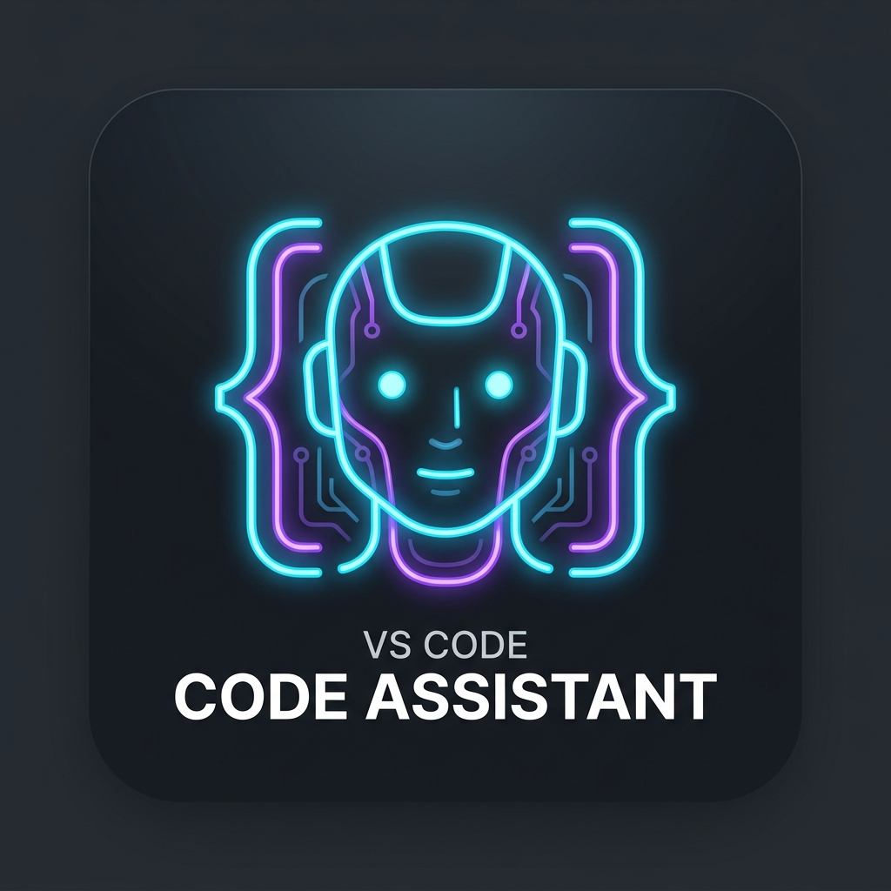

# CodeRun AI Agent 🚀

<p align="center">
  
</p>

[](https://github.com/nbsgr/coderun-agent)
[](https://marketplace.visualstudio.com/items?itemName=Bala-Siva-Ganesh.ai-agent)
[](https://marketplace.visualstudio.com/items?itemName=Bala-Siva-Ganesh.ai-agent)
[](https://nbsgr.github.io/coderun-agent/)
[](https://opensource.org/licenses/MIT)
[](https://nodejs.org)
[](https://github.com/nbsgr/coderun-agent/pulls)

**CodeRun AI Agent** (`AI-AGENT`) is a professional, multi-provider autonomous coding companion for Visual Studio Code. Built upon an advanced agentic loop, CodeRun acts as an intelligent pair programmer capable of reading, writing, and editing files, indexing codebases in a high-speed local SQLite database, running interactive terminal processes, applying precision diffs, and orchestrating multi-step execution plans.

Whether you are running completely offline with local models via **Ollama**, leveraging official API keys (**OpenAI**, **Anthropic Claude**, **Google Gemini**, **Groq**, **OpenRouter**, **xAI Grok**), or routing custom endpoints (**Cloudflare Workers AI**, **vLLM**, **LM Studio**, **Aero Link**), CodeRun delivers a deeply integrated, robust, and secure developer experience.

> 📖 **Official Live Documentation & Architecture Guide:** [https://nbsgr.github.io/coderun-agent/](https://nbsgr.github.io/coderun-agent/)

---

## 🧭 Comprehensive Engineering Standards & Coding Style Contract

The CodeRun AI Agent repository strictly follows a unified, beginner-friendly, modular JavaScript architecture designed for maximum reliability, failure containment, and maintainability. This contract combines core software craftsmanship principles with our production 3-tier extension architecture.

### 📐 1. Core Coding Philosophy & Readability First
Write code to solve the requirement, not to demonstrate language features. Always think in this order:
1. **What is the requirement?**
2. **What is the simplest solution?**
3. **What is the most readable implementation?**
4. **Which language feature naturally fits the solution?**

Never use a language feature simply because it exists. Prioritize:
* **Readability, Simplicity, Maintainability, Debuggability, and Consistency**
* Over shorter syntax, clever one-liners, or modern-looking functional abstractions.
* Write code that another engineer or beginner can easily understand, trace, and debug.

### 📜 2. Language & Environment Constraints
* **Plain ES JavaScript only:** All application, webview, script, and test implementations use `.js` or `.cjs`.
* **Zero TypeScript:** Never use TypeScript (`.ts` / `.tsx`). There is no transpilation or build step.
* **Zero JSX:** No JSX or template compilation layers.
* **Native ES Modules:** Always use `import` / `export` for clean organization, maintainability, and code reuse across runtime, webview, and test modules.
* **CommonJS (`.cjs`):** Reserved strictly for configuration (`.eslintrc.cjs`, `eslint.config.cjs`) or isolated standalone child-process worker scripts (`builtinServers/fetchServer.cjs`).

### ⚙️ 3. Function Declaration Rules

#### ✅ Strict Traditional Named Function Declarations
Always use normal, named function declarations:
```javascript
// PREFERRED:
function saveConversation(conversationId, messages) {
  // clear, readable implementation
}

function calculateDiffStats(originalText, modifiedText) {
  // predictable stack traces in debuggers
}
```

#### 🚫 Disallowed Syntax Patterns
* **No Arrow Functions (`=>`):** Arrow functions are strictly prohibited in runtime code, webview scripts, utilities, and tests.
  ```javascript
  // FORBIDDEN:
  const saveConversation = (conversationId) => {};
  items.map((item) => item.id);

  // PREFERRED:
  function saveConversation(conversationId) {}
  function getItemId(item) { return item.id; }
  items.map(getItemId);
  ```
  *Reason:* Traditional named functions provide readable stack traces in crash dumps and developer tools, have clear hoisting semantics, avoid lexical `this` confusion, and maintain structural consistency with enterprise languages like Java.
* **No Immediately Invoked Function Expressions (IIFEs):** `(function() {})()` is not permitted. Declare a named function and invoke it explicitly.
* **No Function Expressions Assigned to Variables:** Variable-assigned function expressions (`var foo = function() {}` or `const bar = function() {}`) are prohibited; use named function declarations instead.
* **No `.bind()`:** Never use `Function.prototype.bind()`. Pass context or parameters explicitly. *(Intentional SQL.js driver exception: `stmt.bind(params)` in `projectKnowledge.js` is an external database driver parameter binding method, not JavaScript function binding).*
* **No `class` Keyword:** Object factories, prototypes, and plain object literals are used instead of ES classes.
* **No JSDoc `@param` tags:** Function contracts are self-documenting through clean parameters and inline commentary explaining *why*, not *what*.

### 🏷️ 4. Variables, Loops, and Comments
* **Descriptive Variables:** Always use meaningful variable names (`conversation`, `selectedModel`, `providerConfig`, `workspaceFolder`) instead of opaque identifiers (`a`, `b`, `tmp`, `obj`).
* **Focused Functions:** Keep functions small and focused on a single responsibility. Prefer multiple small functions over one giant monolithic function.
* **Readable Loops:** Prefer standard `for` loops whenever readability is clearer. Do not replace straightforward procedural loops with convoluted functional chains without reason.
* **Intentional Comments:** Write comments only when they explain **WHY**, not **WHAT**. Avoid stating the obvious.

### 🌐 5. Asynchronous Programming & Browser Standards
* **Promises & Async/Await:** Use Promises and `async`/`await` when asynchronous operations exist to avoid callback hell. Do not mark functions `async` unless asynchronous operations actually occur within them.
* **`Promise.all` Execution:** Use `Promise.all()` exclusively when independent asynchronous operations can safely execute concurrently (such as parallel file reads, loading settings, and discovering models).
* **Standard Browser APIs:** When writing webview code (`src/UI/`), always prefer standard browser JavaScript (`fetch()`, `localStorage`, `sessionStorage`, `requestAnimationFrame()`, `setTimeout()`, Canvas, DOM APIs, `Map`, `Set`) rather than external frameworks or heavy libraries.

### 🛡️ 6. Zero Swallowed Errors Policy
* **No Empty Catch Blocks:** Empty `catch (_) {}` or `catch (err) {}` blocks that silently swallow exceptions are strictly forbidden.
* **Contextual Subsystem Logging:** Every catch block must record diagnostic context using standardized subsystem tags:
  * `[EXTENSION]`: Extension lifecycle, activation, and HTML rendering errors.
  * `[AGENT_LOOP]`: Model streaming, iteration limits, and loop failures.
  * `[TOOL_EXEC]`: Tool parameter parsing, execution, or file system errors.
  * `[TERMINAL]`: Shell process spawns, streams, and interrupt errors.
  * `[MCP]`: JSON-RPC protocol, client transport, and Python venv errors.
  * `[MEDIA]`: Image/video endpoint routing and extraction errors.
  * `[TRACE]`: Trace recording and disk persistence errors.

### 🏗️ 7. 3-Tier Modular Architecture (Controller → Handler → Manager)
The repository enforces strict physical and logical separation between the Backend Extension Host (`src/extension/`) and Frontend Webview (`src/UI/`):

1. **Strict Separation of Concerns:**
   * `src/UI/`: All Frontend Webview DOM rendering, styling, and UI controllers/managers. Zero VS Code API imports.
   * `src/extension/`: All Backend Extension Host logic, commands, and host controllers/handlers/managers. Zero DOM / browser API usage.
2. **Controller Tier (Pure Routers):**
   * Backend: `src/extension/controller/UI-controller.js` routes `webview.onDidReceiveMessage`.
   * Frontend: `src/UI/controller/host-controller.js` routes `window.addEventListener("message")`.
   * **Strictly zero business logic in controllers.**
3. **Handler Tier (Payload Coordinators):**
   * Located in `src/extension/manager/*handler.js` (backend) and `src/UI/chats/chats-*-manager.js` (frontend).
   * Validate incoming payloads, coordinate domain managers, and return formatted responses via IPC.
4. **Manager Tier (Business Logic & Core Engines):**
   * `src/extension/tools/tools.js` (36 tool implementations), `agentLoop.js` (orchestration), `projectKnowledge.js` (SQLite AST indexer via `SQL.js`), `checkpointManager.js` (snapshots & rollbacks), `diffManager.js` (staged diffs), `terminalManager.js` (dual terminal lifecycle).
5. **Anti-Collision Namespacing:**
   * Isolate command names (`coderun.*`), view container IDs, terminal session names (`CodeRun(main)` and `CodeRun(BG)`), and storage under `context.globalStorageUri`.

### 🔒 8. Operational Boundaries & Quality Gates
* **Session Ownership:** Agent state, permissions, terminals, diffs, checkpoints, and traces are strictly isolated per conversation/session ID.
* **Quality Gates:** Every commit must pass:
  1. `node --check <file>`: Strict JavaScript syntax verification.
  2. `npm run lint`: ESLint with custom AST rules enforcing **0 errors**.
  3. `npm test`: Full adversarial regression suite with **all 87 test groups passing cleanly**.

---

## 🌟 Key Highlights & Features

### 🤖 Multi-Provider Model Orchestration
*   **8 Native Providers Supported:** Ollama, OpenAI, Anthropic Claude, Google Gemini, Groq, OpenRouter, xAI (Grok), and custom OpenAI Compatible endpoints.
*   **Intelligent Media Routing & Persistent Storage:** Automatically classifies image and video models (such as `agnes-image-*`, `dall-e-*`, `flux`, `sdxl`, `agnes-video-*`, `sora`, `kling`, `runway`, `minimax`) using provider metadata inspection and keyword heuristics. Routes media generation requests directly to `/v1/images/generations` and `/v1/videos` instead of chat completions to prevent HTTP 400 errors.
*   **Native Zero-Dependency HTML5 Video Player:** Generated videos render with a built-in interactive HTML5 player:
    *   **Play / Pause Toggle:** Click the player button or click directly on the video screen.
    *   **Skip ±10 Seconds:** Quick rewind (`⏪ -10s`) and forward (`⏩ +10s`) buttons.
    *   **Draggable Progress Scrubber:** Responsive range slider with real-time progress fill bar tracking watched time.
    *   **Timestamps & Display Controls:** Monospace current/duration time indicators (`0:05 / 0:30`), Volume Mute toggle (`🔊`/`🔇`), and Fullscreen toggle (`⛶`).
*   **Storage Isolation & Manual "Save to Project":**
    *   **Zero Workspace Pollution:** Generated media is saved strictly into VS Code's persistent `globalStorageUri/media/` folder for chat history persistence. It is **never** saved directly into your workspace automatically.
    *   **Manual Export On-Demand:** Clicking the **"📥 Save to Project"** button on any media card copies the file into `<workspace>/assets/<fileName>` and displays a VS Code notification with an **"Open File"** action.
*   **Adaptive Self-Healing & Async Task Polling:** Automatically adapts payloads if an endpoint requires `mode: 'text'`, polls asynchronous video generation tasks across standard and custom routes, and automatically retries with exponential backoff on HTTP 503 `video_queue_full` errors.
*   **Differentiated Request Timeouts (Local-First vs Cloud):**
    *   **Local LLMs (Ollama / Localhost / 127.0.0.1 / :11434):** Generous **10-Minute Timeout (600,000 ms)** allowing local models ample time for cold weight loading and extended inference without premature "Request timed out." errors.
    *   **Remote Cloud Providers (OpenAI, Anthropic, OpenRouter, Groq):** **30-Second Timeout (30,000 ms)** for prompt network failure detection.
    *   **Automatic Detection:** Automatically identifies local runtimes via `isLocalEndpoint(config)`.
*   **Saved Provider Configurations:** Save credentials (API keys, base URLs, default models) for multiple endpoints. Switch models on the fly in the middle of a chat session without resetting settings.
*   **Unified Model Dropdown:** All models from your active and saved providers are dynamically retrieved and presented in a single, clean dropdown, grouped logically by provider.
*   **API Type Selection:** Custom compatible providers support setting the underlying **API Type** (**OpenAI Compatible**, **Anthropic Compatible**, or **Google Gemini Compatible**) to correctly format request bodies, endpoint paths, and API headers.
*   **Cloudflare Workers AI Support:** Dynamically parses Cloudflare base URLs to extract your Account ID and retrieve model lists using Cloudflare's search API.
*   **Google Gemini Protobuf & Schema Sanitization:** Automatic schema normalization recursively strips unsupported JSON Schema keywords (`additionalProperties`, `$schema`, `title`, `$defs`, `definitions`) before submitting to Gemini endpoints, preventing HTTP 400 rejection on complex schemas (such as Puppeteer browser tools). Automatically normalizes model names to prevent HTTP 404 lookup failures.

### 💻 Interactive Terminal Execution & Dual Terminal Architecture
*   **Dual Dedicated Terminal Sessions per Chat:** Every chat maintains two isolated, visible VS Code terminal sessions:
    *   **`CodeRun(main)`**: Dedicated direct/foreground terminal executing standard CLI commands, tests, builds, and interactive REPLs with real-time output streaming.
    *   **`CodeRun(BG)`**: Dedicated background terminal running persistent dev servers (`npm run dev`, `vite`, `python -m http.server`, daemons) with real-time output streaming and automatic localhost URL/port sniffing.
*   **Full Interactive Session Lifecycle:** Launch interactive REPLs (Node, Python, Ruby, MySQL, npm init, etc.) with `run_terminal` (`interactive: true`).
*   **Live Keystroke Delivery:** Send commands and inputs dynamically to active sessions using `terminal_input`, with clean multi-line and escape character normalization.
*   **Selective Terminal Interrupts (`stop_terminal`):** Send clean interrupt signals (`\u0003` / `Ctrl+C`) to active terminals with granular target selection:
    *   `target: "foreground"` (default): Interrupts hanging foreground commands or tests in `CodeRun(main)` without terminating background dev servers.
    *   `target: "background"`: Gracefully terminates dev servers and daemons in `CodeRun(BG)` without disturbing foreground shell state.
    *   `target: "all"`: Aborts active executions across both terminals simultaneously.
*   **Terminal State Introspection (`check_terminal_state` / `get_terminal_state`):** Inspect the full execution state of `CodeRun(main)` or `CodeRun(BG)` on demand. Retrieves the last executed command, exit code, whether it exited with exit code 0 (`exit_code_zero`), status (`idle`, `active`, `waiting_for_input`, `completed`), stdout/stderr, working directory, duration, shell, and platform. Includes cross-terminal history fallback so output is never lost if a command was run in the sibling terminal.
*   **Model-Driven Interactivity & Background Execution:** The AI model dynamically decides whether a terminal command should run interactively or in the background based on real-time task context, rather than relying strictly on rigid command lists.
*   **Automated Terminal Pager Suppression:** Transparently injects `$env:PAGER='cat'`, `GIT_PAGER=cat`, and `--no-pager` into terminal execution pipelines, completely eliminating infinite terminal hangs caused by command pagers (`git diff`, `git log`, `more`, `less`).
*   **UI Transparency & Distinguishable Badging:** Chat UI terminal cards display real-time output logs and feature clear visual badges:
    *   Emerald badge and header prefix: `[CodeRun(main)]`
    *   Indigo badge and header prefix: `[CodeRun(BG)]`
*   **Smart Prompt Detection:** Accurately detects interactive question prompts (e.g. `(y/N)`, `Password:`, `>>>`) while filtering out standard idle shell prompts (`PS ...>`, `user@host:~$`).
*   **ANSI Escape Cleaning:** All ANSI escape sequences, OSC markers, and VS Code shell integration codes are stripped before rendering.

### 📋 Real-Time Checklist & Todo Tracking
*   **Cognitive Brain/Body Architecture:** The LLM serves as the cognitive brain creating and updating plans; the runtime faithfully tracks and renders progress.
*   **Live Progress Bar:** The composer displays a live `Todos (X/Y)` bar reflecting in-progress `[/]` and completed `[x]` tasks as each step finishes.
*   **Graceful Auto-Hide on Completion:** When all tasks finish (`Todos (13/13) ✓`), the panel confirms completion and smoothly fades out after 5 seconds to keep the workspace clean.
*   **Collapsible & Inspectable:** Click the Todos header anytime to expand and review all checklist steps.

### 💬 Interactive User Questions (`ask_question`)
*   **Proactive Clarification Prompts:** When encountering ambiguous architectural decisions or missing configuration values, CodeRun pauses and presents interactive question banners directly in the chat.
*   **Clickable Option Chips & Write-In:** Choose from pre-configured single or multi-select chips with real-time visual selection indicators, or type custom freeform answers.
*   **Non-Blocking & Session-Isolated:** Question lifecycles are strictly session-isolated in `questionManager.js`, with seamless auto-focus and keyboard submission.

### 📋 Message Copy Buttons & Clipboard Fidelity
CodeRun provides dedicated one-click copy buttons across conversation messages, engineered to preserve exact content fidelity without UI noise or formatting loss:

*   **User Query Copy Button (`[Copy]` in User Bubble Footer):**
    *   **What is copied:** The exact prompt text submitted by the user.
    *   **Fidelity & Formatting:** Copies raw unadulterated text — preserving user-provided multi-line formatting, indentation, code snippets, and shell commands. It does **not** copy UI artifacts, image attachment previews, avatars, or timestamps.
    *   **Layout & Alignment:** Anchored on the left of `.cr-user-footer`, accompanied by the message submission timestamp on the right (`[Copy] 11:23 PM`), right-aligned within the user bubble. The pair uses compact gap spacing (`gap: 8px`) rather than wide stretching, ensuring concise queries like `"hi"` maintain clean proportions.
    *   **Visual Confirmation:** Instantly swaps to `✓ Copied!` with emerald highlighting and a checkmark icon, automatically reverting to `Copy` after 1.8 seconds.

*   **Agent Response Copy Button (`[Copy]` at the End of Agent Loop):**
    *   **What is copied:** The complete Markdown response generated by the AI assistant for that conversational turn.
    *   **Fidelity & Formatting:** Copies clean Markdown source text directly (retaining Markdown headers `#`, bulleted/numbered lists, inline backticks, bold/italic markup, and triple-backtick code blocks). It does **not** copy model thinking/reasoning blocks (`<think>`), tool parameter cards, execution trace dropdowns, or system errors. If the response contains multiple content chunks (e.g. text before a tool call and text after a tool call), all assistant text blocks are cleanly concatenated with newlines.
    *   **Ending Timestamp & Layout:** Anchored in the card footer (`.cr-bot-footer`) at the very end of the bot message card, spanning the card with `[Copy]` on the far left and the final completion timestamp (`11:23 PM`) on the far right via `justify-content: space-between`.
    *   **Loop Completion & Historical Support:** Automatically attaches when the agent loop completes (`agent_done` / `done` / `stream_end`), on stream error termination, and whenever restoring previous chat sessions from history.

*   **Fenced Code Block Copy Button (`[Copy]` in Code Block Headers):**
    *   **What is copied:** The isolated source code snippet contained strictly within that code block.
    *   **Fidelity & Formatting:** Copies pure code without language tags (`typescript`, `python`, `json`), line numbers, or surrounding markdown backtick fences.

### 🧠 Advanced Agent Loop & Concurrency
*   **Think → Plan → Act → Verify:** Multi-iteration loop executing tool actions, verifying outputs, and learning repository patterns.
*   **Parallel Concurrency for Read-Only Tools:** Concurrent execution of independent read and search operations (`read_file`, `search_files`, `find_in_files`, `get_file_info`) via `Promise.all` for maximum speed.
*   **Per-File Mutation Serialization:** Atomic file write locking via `fileLockManager.js` ensures sequential safety during concurrent writes.
*   **Repetitive Failure Circuit Breaker:** Automatically detects repeated tool failures on identical arguments, halting loops and prompting reflection.
*   **Zero-Latency Reasoning Stream:** Real-time synchronous token extraction and rendering for reasoning models (DeepSeek-R1, Gemma 4, o3-mini) in collapsible **Thought Process** blocks with live auto-scroll.
*   **Persistent User Dropdown Retention:** User-opened dropdowns stay open across multi-step execution loops until manually collapsed by the user, while reloaded conversations start cleanly collapsed.
*   **Signal Cancellation & Safe Stop:** Abort signals propagate cleanly into active tool invocations, auto-retries, and recovery steps without race conditions.

### 🧩 Native VS Code LSP & Diagnostic Self-Reflection
*   **VS Code Language Server Commands (`src/extension/tools/tools.js`):** Interacts directly with VS Code's internal language provider commands:
    *   `get_definition`: Invokes `vscode.commands.executeCommand('vscode.executeDefinitionProvider', uri, position)`. Returns the definition file path, line, character, and line preview. If the provider returns no results (or runs outside VS Code), falls back to cursor token extraction and local symbol lookup via `symbolParser.js`.
    *   `find_references`: Invokes `vscode.commands.executeCommand('vscode.executeReferenceProvider', uri, position)`. Returns all referenced locations with file paths, lines, characters, and preview snippets, with regex workspace fallback.
    *   `document_symbols`: Invokes `vscode.commands.executeCommand('vscode.executeDocumentSymbolProvider', uri)`. Recursively formats symbols into hierarchical objects with name, SymbolKind string (`Class`, `Method`, `Function`, `Variable`, etc.), and start/end line bounds. Falls back to regex-based symbol parsing if uninitialized.
*   **Compiler & LSP Diagnostic Inspection (`src/extension/execution/reviewEngine.js`):**
    *   In the self-reflection review phase, `checkCompilerDiagnostics()` queries `vscode.languages.getDiagnostics(uri)` for modified files.
    *   Filters specifically for `DiagnosticSeverity.Error` (severity `0`), capturing file path, line number, source name, and error message to fail review audits if code modifications introduce syntax or compiler breaks.
*   **Embedded SQLite Knowledge Base (`src/extension/context/projectKnowledge.js`):**
    *   Maintains a WebAssembly-based SQLite database (`index.db`) powered by `sql.js` in `globalStorageUri/projects/<Name_Hash>/` tracking indexed files, text chunks, metadata, and parsed symbols.
    *   **`query_project_db` Tool:** Allows executing read-only `SELECT` SQL queries against this local database (strictly rejects any mutation statements like `INSERT`, `UPDATE`, `DELETE`, `DROP`).

### 🛡️ Clean Error Boundary & Dynamic Auto-Sizing
*   **Dynamic Card Sizing:** Error notification cards automatically adapt their height and width to fit the exact volume of text and diagnostic details without awkward clipping.
*   **Complete Boundary Containment:** Long uninterrupted URLs (e.g. Google API rate limit links, stack traces) and JSON payloads wrap cleanly using `overflow-wrap: anywhere` and `word-break: break-word`, preventing text from spilling outside the red card boundaries.
*   **Top-Aligned Status Icons:** The error icon is neatly pinned to the top-left of multi-line error blocks rather than floating vertically in the center.
*   **Deduplicated Error Pipeline:** Webview error handling unifies internal agent loop events and terminal stream failures, stripping redundant `"Error: "` prefixes and preventing duplicate stacked error cards.

### 🔍 Diff Management & Approval Pipeline
*   **Granular Tool Permission Gating:** Sensitive filesystem and execution tools (`read_file`, `create_folder`, `write_file`, `edit_file`, `patch_file`, `delete_file`, `delete_folder`, `run_terminal`, `terminal_input`) require explicit user confirmation before executing.
*   **Centralized Sticky Confirmation Bar:** Permission actions (`Allow`, `Deny`, `Always Allow`, `Always Deny`) are cleanly anchored in the sticky controls panel above the chat input, preventing layout jitter and keeping chat history focused.
*   **Clean Dropdown Tool Cards:** Embedded tool cards display tool inputs and parameters cleanly with an active "Permission Required" status badge, automatically updating to `✓ Allowed` or `✗ Denied` once resolved without redundant nested buttons.
*   **SHA-256 Optimistic Concurrency:** Stages proposed file changes in memory with baseline SHA-256 hashing to prevent overwriting external disk edits.
*   **Auto-Open Inline Webview Diffs:** Diffs (`<details class="cr-diff-details">`) open by default during permission checks and tool executions so users immediately review file changes before approving/rejecting, automatically collapsing upon resolution.
*   **Side-by-Side Editor:** Inspect additions (green) and deletions (red) directly inside chat cards or launch native side-by-side VS Code diff editors.
*   **Single-Click Batch Operations:** Accept or reject individual diffs or click **Accept All** / **Reject All** in the agent controls bar.

### ↩️ Database-Backed Snapshots & Checkpoints
*   **SQLite-Powered Snapshots:** Snapshots files into a local SQLite database (`index.db`) before any mutation.
*   **Single-Click Undo:** Real-time **Undo** buttons appear directly under assistant responses for instant rollback.
*   **Command Palette Integration:** Run `CodeRun: Undo Last Edit` at any time.

### 📦 0ms Local Context Compaction & Checkpoint Cards
*   **Deterministic Local Compaction:** Automatically compacts verbose conversational turns, inspection tools, and directory listings into concise status summaries (`Read file`, `Wrote file`, `Patched file`) with 0ms execution time and zero token costs.
*   **Turn Range Boundaries:** Displays explicit turn boundary counters `(Turns 1 - N)` on the checkpoint bubble header, protected against overflow or truncation.
*   **Unified Native Tool Card Styling:** Collapsible sub-sections use the project's native card design (`.cr-tool-card.cr-cp-card`) with dark backgrounds (`#0b0f17`), subtle borders, inline icons, timing metadata, and rotating chevrons:
    *   💬 **User Message (N):** Expands to show formatted user inputs.
    *   🕒 **Thought Process:** Captures model thinking steps with duration timing.
    *   🔧 **Tool Calls (N):** Shows full executed tools table with tool names, parameters, execution times, and success/failure badges, immune to boundary overflow on long names.
    *   ✨ **Response Summary:** Completely preserves the model's full final response, numbered lists, and instructions without premature truncation.
*   **Instant Local Execution:** Runs 100% on the client machine without external LLM summarization API overhead.

### ⚡ Multi-Turn Context Optimization & Historical Tool Compaction
*   **Active Turn Full-Fidelity:** In the active agent loop iteration, tools like `read_file` and `run_terminal` deliver complete, raw outputs so the LLM has full fidelity to reason, analyze code, and execute changes.
*   **Automatic Historical Compaction:** In subsequent conversation turns, historical inspection, search, and terminal outputs are automatically compacted into lightweight status lines (e.g. `✅ Read file 'main.py' successfully` or `✅ Command 'npm test' executed successfully (exit code 0)`), reducing context payload by up to 90%.
*   **Selective Failure & Mutation Retention:** If any tool fails, the complete error message, stack trace, and exit codes are preserved in full so the model remembers what went wrong. Code mutation tools (`write_file`, `edit_file`, `patch_file`, `delete_file`) retain full responses and diff details.
*   **100% Wire Protocol & UI Integrity:** Historical tool call schemas and `tool_call_id` pairing remain strictly compliant with OpenAI, Anthropic, Gemini, and Ollama specifications. Webviews, real-time tool cards, execution traces, checkpoints, and SQLite logs retain complete, unadulterated history.
*   **Local LLM Immunity:** Completely eliminates context saturation crashes and VRAM swapping on local Ollama models (such as Qwen 2.5 Coder or DeepSeek-R1) with 8K–32K context limits.

### 🪵 Real-Time Visual Execution Traces
*   **Dual View (`[Chats]` / `[Traces]`):** Switch between conversational chat and an interactive step-by-step trace graph.
*   **Detailed Step Diagnostics:** Inspect exact system prompts, LLM decisions, duration in milliseconds, inputs, and outputs per step.
*   **One-Click Export:** Copy individual step data or export the full run JSON to clipboard.

### 📜 Global & Workspace Rules Engine
*   **Hierarchical Rule Precedence:** Define Global Rules (`~/.coderun/rules`) that apply everywhere across all projects, and Workspace Rules (`.coderunrules`) scoped to the active repository.
*   **Integrated Code-Style Editor:** In-app editor with dynamic line number gutters, synchronized scrolling, one-click open in VS Code, and instant `Ctrl + S` saving.

### 🔄 Tool Lifecycle State Sync
*   **Reliable Lifecycle Transitions:** Every tool follows the exact lifecycle: PENDING → WAITING_FOR_PERMISSION → RUNNING → COMPLETED/FAILED/CANCELLED. No tool card remains stuck in RUNNING.
*   **Provider-Compatible Card Linking:** Cards are stored under multiple key aliases (toolCallId, index key, toolName key), ensuring `tool_result` events find the correct card regardless of whether the LLM provider emits tool call IDs or not.
*   **Backwards DOM Fallback:** When lookup keys fail, the DOM search iterates backwards to find the most recently created card — fixing issues where multiple calls of the same tool (e.g., two `update_plan` invocations) would update the wrong card.

### 📊 Live Context Window & Monotonic Token Tracking
*   **Monotonic Cumulative Token Accumulation:** Token counts strictly accumulate across all conversational turns and tool iterations. Total Consumed never decrements or resets when continuing conversations.
*   **Live Context Window Gauge:** Real-time visual progress bar and token ratio (`X / Y (Z%)`) indicating the model's active context window occupancy.
*   **Saturation Alerts:** Progress bar dynamically shifts from normal blue to amber warning (`≥70%`) and critical red (`≥90%`) as the context fills, alerting you before hitting model limits.
*   **Dynamic Context Limit Discovery:** Automatically fetches accurate context window sizes (`context_length`, `context_window`, `inputTokenLimit`) directly from provider APIs (OpenRouter, Groq, Ollama, Gemini) via raw REST discovery, with heuristic architectural fallbacks.
*   **Detailed Session Info Modal:** Click the token badge anytime to inspect Total Consumed, active Context Window usage, Input / System tokens, Output / Response tokens, and trigger 1-click conversation compaction.

### 📦 Transparent User Sandbox Directory & Terminal CWD Synchronization
*   **Dedicated Isolated Workspace:** Transparently provides a dedicated scratch sandbox directory at `~/.coderun/sandbox/` alongside the main workspace.
*   **Automatic Terminal CWD Synchronization:** When running terminal commands targeting sandbox files or test scripts, CodeRun automatically sets the terminal working directory (`cwd`) to `~/.coderun/sandbox/`, allowing relative script and tool execution without dirtying the repository.
*   **Built-in Path Isolation & Security:** All standard file operations (`read_file`, `write_file`, `edit_file`, `patch_file`, `delete_file`) natively accept paths inside the user sandbox directory, with automatic path canonicalization and directory traversal protection.
*   **Dedicated `sandbox` Management Tool:** Inspect sandbox status, list sandbox contents, or clean temporary files on demand (`action: 'status' | 'list' | 'clean'`).

### 🎭 On-Install Browser Setup & Zero-Config Puppeteer MCP
*   **Local Browser Auto-Detection:** Automatically discovers installed Google Chrome, Microsoft Edge, Brave, and Chromium executables across Windows, macOS, and Linux.
*   **Zero-Friction Fallback Installation:** If no system browser is found, CodeRun automatically installs a lightweight, dedicated Chromium binary into `~/.coderun/browser/` on first run via `@puppeteer/browsers`—completely eliminating runtime browser missing errors.
*   **Dual-Resolution Tool Aliases:** MCP tools resolve seamlessly whether invoked with full namespaced names (`mcp__puppeteer__puppeteer_navigate`) or direct aliases (`puppeteer_navigate`), preventing "Tool not found" execution stalls across different LLM providers.

### 🔌 Model Context Protocol (MCP) & Extensibility
*   **Full MCP Client Integration:** Seamless stdio-based Model Context Protocol client with capability negotiation, automated tool schema extraction, and dynamic registration into the agent loop.
*   **Built-in Server Catalog:** Pre-configured support for Web Fetcher (`web-fetch`), Memory Graph (`memory`), GitHub (`github`), and Puppeteer (`puppeteer`).
*   **Multi-Runtime Execution (Node.js & Python):** First-class support for both Node.js (`npx` / `node`) and Python (`uvx` / `python`) MCP servers. Runtimes are treated as execution environments, enabling servers like GitHub, MySQL, PostgreSQL, or custom tools to run seamlessly in either Node or Python with real-time argument adaptation.
*   **Environment Isolation & Unbuffered Stdio:** Python MCP servers run in an isolated environment with automatic `PYTHONUNBUFFERED=1` and `PYTHONIOENCODING=utf-8` injection, preventing stdio buffer stalls on Windows, macOS, and Linux.
*   **Actionable Missing Module Guidance:** If a Python module is not installed, CodeRun intercepts stderr and surfaces an immediate, actionable tip (e.g. `pip install <package>`, `uvx <package>`, or path to local script) right in the UI.
*   **Zero-Config Browser Automation:** Embedded system browser discovery automatically locates installed Google Chrome, Microsoft Edge, Brave, or Chromium binaries across Windows, macOS, and Linux — no manual browser installation needed.
*   **Custom MCP Server Management:** Register arbitrary custom MCP servers directly from the Settings view with per-tool permissions and toggle controls.

### 🤖 Autonomous Subagent Workers & Multi-Agent Delegation
*   **Hierarchical Task Delegation:** Spawn child AI agents with `spawn_subagent` to tackle independent subtasks (architecture planning, code generation, test verification, security review) concurrently or synchronously.
*   **Dual Execution Modes:**
    *   `sync` / `parallel` / `async`: Launches subagents in the background non-blocking, immediately returning confirmation while the child agent works in parallel with the main agent. The main agent can concurrently run terminal commands or perform inspections while the subagent runs.
    *   `wait`: Synchronously blocks until the subagent completes its full loop and delivers verified final results back to the parent session.
*   **Tool Isolation & Anti-Recursion Safety:** Subagents are provisioned with full workspace manipulation tools (`create_folder`, `write_file`, `edit_file`, `read_file`, `run_terminal`, etc.) while subagent delegation tools are filtered out, strictly preventing runaway recursive spawning loops.
*   **Per-Action Checkpointing & Instant Undo Rollback (`↩ Undo`):** File creation, writing, and editing operations by subagents generate automatic snapshot checkpoints with single dedicated `↩ Undo` buttons under approved diff cards.
*   **Bi-Directional Undo Reflection Across All Views:** Undoing a checkpoint (from the main chat diff card or the Subagents tab) immediately transitions the card status to `✓ RESTORED` / `✓ Restored` across open views, subagent execution chat, traces, and backend storage.
*   **Full Subagent Lifecycle Management:** Complete toolset to control running subagents: `subagent_status` (inspect progress, active steps, read/written files), `subagents_list` (session-wide subagent registry), `stop_subagent` (graceful termination), and `wait_for_subagent` (join async subagents).
*   **Dedicated Subagent Settings Panel (`🤖`):** Access dedicated Subagent Settings via the robot emoji (`🤖`) on the navigation rail to configure provider, model, and execution limits independently of the main chat agent.
*   **Saved Providers Selection:** Subagent provider dropdown lists only saved, verified provider configurations (e.g. Ollama, OpenAI-compatible endpoints) rather than unconfigured generic endpoints, with `(Inherit from Main Agent)` as the default.
*   **Model Combobox with Instant Search:** Full-featured searchable model combobox matching the main chatspace with sticky search bar (`🔍 Search models...`), collapsible provider groups, and active checkmark badges (`✓`).
*   **Automatic Model Inheritance:** Selecting `(Inherit from Main Agent)` automatically syncs the subagent model to inherit the main agent's active model in real time.
*   **Distinct Checkpoint & Trace Attribution:** Checkpoints, file modifications, and execution traces are attributed to unique subagent IDs (`agentId`), enabling isolated rollbacks and dedicated Subagent Traces inspection.

### 🎨 Intelligent Image & Video Generation & Persistent Media Storage

<p align="center">
  
</p>

*   **Dual-Strategy Modality Classification:**
    *   **Strategy 1 (Provider Metadata Inspection):** Automatically inspects model metadata returned by OpenAI, OpenRouter, and OpenAI-compatible providers (examining `type`, `modalities`, `architecture.modality`, and `task`) to determine whether a model is intended for text chat, image generation, video generation, or embeddings.
    *   **Strategy 2 (Keyword Token Heuristics):** Fallback token analysis identifies models from their ID or alias (detecting `video`, `sora`, `kling`, `runway`, `image`, `dall-e`, `imagen`, `flux`, `sdxl`, `embed`, `audio`), ensuring unannotated custom proxies like `agnes-image-2.5-flash` or `agnes-video-2.5` route properly without manual configuration.
*   **Two-Layer Execution Safeguard & Self-Healing:**
    *   **Pre-Flight Direct Media Dispatch:** When a model is known to be an image or video model, the agent bypasses standard chat completion (`/v1/chat/completions`) entirely and dispatches the user's prompt directly to `/v1/images/generations` or `/v1/videos`.
    *   **Runtime Self-Healing Recovery:** If an uncatalogued model is called via chat and the upstream server responds with HTTP 400 (e.g. `"Model X is an image model. Use /v1/images/generations"` or `"Model Y is a video model. Use /v1/videos"`), CodeRun catches the error, parses the target endpoint, re-routes the prompt to the appropriate media pipeline, and presents the generated asset seamlessly.
*   **Persistent Storage in VS Code `globalStorage`:**
    *   **URL Expiration Elimination:** Cloud providers frequently return short-lived signed URLs (SAS tokens expiring within 60 minutes). CodeRun immediately downloads remote media assets and writes them to `<globalStorageUri>/media/`.
    *   **Zero `localStorage` Bloat:** Large base64 data payloads are saved directly as binary files (`.png`, `.jpg`, `.mp4`, `.webm`) on disk instead of congesting browser `localStorage`, preventing the 5MB browser storage quota limit from ever being exceeded.
    *   **Secure Webview URI Resolution:** Local media paths are transformed via `webview.asWebviewUri(vscode.Uri.file(filePath))` for smooth, sandboxed display inside VS Code webviews.
*   **Interactive Chat UI Cards & Built-in HTML5 Player:**
    *   Images and videos render inside `.cr-media-card` components with subtle border styling, responsive aspect ratios, and full playback controls for videos.
    *   **Zero-Dependency HTML5 Video Player:** Includes ▶/⏸ play/pause, ⏪ -10s rewind, ⏩ +10s forward, a draggable range progress scrubber with real-time fill tracking, current/duration timestamps (`0:05 / 0:30`), volume mute, and fullscreen toggle.
    *   **"Save to Project" Button:** Copies the asset from isolated global storage into `<workspace>/assets/<fileName>` on demand with a notification and "Open File" action.
    *   **"Copy URL" Button:** Copies the resource URI or path directly to your clipboard for quick sharing.
*   **Visual Modality Badges & Adaptive Input:**
    *   The model dropdown visually tags models with modality icons (`🖼️ Image`, `🎬 Video`, `🔍 Embed`).
    *   Selecting an image or video model dynamically adapts the chat composer placeholder (e.g., `"Describe the image you want to generate..."`), guiding user interaction.
*   **Native Agent Media Tools (`generate_image`, `generate_video`):**
    *   Agents can autonomously generate visuals, UI mockups, and video assets during execution loops using the registered `generate_image` and `generate_video` tools.

---

## 🏛️ Architecture and Features

Key architectural design decisions, technical capabilities, and built-in subsystems powering **CodeRun AI Agent**:

| Feature / Capability | Architectural Design | Implementation & Highlights |
| :--- | :--- | :--- |
| **Modular Engine Architecture** | Decomposed runtime across 7 specialized engines (Context, Delegation, Tool Execution, Media, Decision, ContextBuilder, StateMachine) | ✅ **Failure Containment** reducing agentLoop by 50% to a pure coordinator |
| **Multi-Provider Support** | Modular provider adapters in `src/extension/providers/` with unified normalization & streaming | **8 Providers** (Ollama, Gemini, OpenAI, Claude, Groq, OpenRouter, xAI, Custom) |
| **100% Free & Local (Ollama)** | Native Ollama streaming adapter with model context length discovery | ✅ **Native** streaming, vision & context autodiscovery |
| **Transparent User Sandbox** | Dedicated user sandbox directory (`~/.coderun/sandbox/`) with automatic CWD sync | ✅ **Native** isolated execution without polluting workspace git repo |
| **On-Install Browser & Puppeteer MCP** | Embedded browser discovery in `src/extension/mcp/mcpManager.js` + Puppeteer MCP server | ✅ **Auto-detects Chrome/Edge/Brave** or installs Chromium with screenshot capture |
| **Persistent Memory Graph MCP** | Built-in stdio-based knowledge graph server (`src/extension/mcp/builtinServers/memoryGraphServer.cjs`) | ✅ **Pre-configured built-in catalog** for cross-session entity & relation tracking |
| **Media Model Routing & Persistence** | Dual-strategy classifier in `src/extension/providers/modelClassifier.js` + `src/extension/media/mediaManager.js` | ✅ **Automatic routing** to `/v1/images/generations` and `/v1/videos` with persistent disk storage in VS Code `globalStorage` |
| **Deterministic Context Compaction** | Local 0ms checkpoint generator (`src/extension/context/compactionManager.js`) | ✅ **0ms Instant Local Checkpoints** with zero external API calls or token cost |
| **Historical Tool Compaction** | Wire-protocol optimizer in `src/extension/context/contextManager.js` | ✅ **Automatic** reduction of old tool turns by up to 90% while retaining full active outputs & failure diffs |
| **Local SQLite Codebase Index** | Embedded SQL.js database (`src/extension/context/projectKnowledge.js`) with serialized disk persistence | ✅ **Embedded SQL.js** for fast local symbol & file indexing with zero cloud upload |
| **Interactive Terminal REPLs** | VS Code Terminal API bridge with shell integration & prompt detection (`src/extension/tools/terminalManager.js`) | ✅ **Full lifecycle** (`terminal_input`, prompt detection, `stop_terminal` Ctrl+C) |
| **Dynamic Card Error Containment** | Dynamic card sizing & auto-wrapping CSS (`overflow-wrap: anywhere`) | ✅ **Auto-wrapping & no boundary overflow** on long uninterrupted URLs and JSON payloads |
| **Live Monotonic Token Tracking** | Real-time context window gauge with model limit store (`modelContextWindows`) | ✅ **Real-time saturation warnings** (proactive visual alerts at 70% and 90%) |
| **Interactive User Questions** | Session-isolated question lifecycle manager (`src/extension/tools/questionManager.js`) | ✅ **`ask_question` with interactive option chips & custom write-in** |
| **Native VS Code LSP & Diagnostics** | Language Server Protocol integration in `src/extension/tools/tools.js` & `src/extension/execution/reviewEngine.js` | ✅ **Native LSP** (`get_definition`, `find_references`, `document_symbols`) + live compiler diagnostic self-healing |
| **Zero-Latency Reasoning & UI State** | Synchronous thinking stream & persistent user toggles in `src/UI/chats/chats.js` | ✅ **Instant auto-scroll** for reasoning models + dropdown state preservation across agent loops |
| **Autonomous Subagent Workers** | Hierarchical subagent runner in `src/extension/agents/subagentManager.js` with dedicated tools | ✅ **Background (`sync`) & Synchronous (`wait`) delegation** with checkpoints, undo reflection & dedicated 🤖 settings |
| **Adversarial Regression Tests** | Standalone test harness (`test/runAllTests.js`) with 0 external dependencies | ✅ **87 Test Groups** covering concurrency, permissions, SSRF, locks, recovery, subagents, checkpoints, dual terminals, terminal introspection & tools |


---

## 🧰 Complete Tool Matrix (34 Core Tools)

CodeRun exposes a curated set of **34 active core tools** organized across 9 operational categories. The LLM receives standard function calling schemas for these tools, while heavy index operations (such as SQLite indexing) run deterministically in the background.

| Category | Tool | Description | Dangerous / Permissions |
| :--- | :--- | :--- | :--- |
| **📁 File Operations** | `read_file` | Read complete file contents at a relative path or inside sandbox | ⚠️ Yes |
| | `write_file` | Create or overwrite a file with full diff preview | ⚠️ Yes |
| | `edit_file` | Find and replace a single exact string occurrence | ⚠️ Yes |
| | `patch_file` | Apply multiple search-and-replace edit blocks | ⚠️ Yes |
| | `delete_file` | Permanently delete a specified file | ⚠️ Yes |
| | `create_folder` | Create directory structure including parents | ⚠️ Yes |
| | `delete_folder` | Recursively delete a directory and its contents | ⚠️ Yes |
| | `get_file_info` | Get file metadata (size, lines, modified date, MIME) | No |
| **🔍 Search & Navigation** | `search_files` | Find files matching glob patterns (e.g. `*.js`, `src/**`) | No |
| | `find_in_files` | Search workspace file contents for text queries | No |
| | `list_symbols` | Parse classes, functions, and symbols with line numbers | No |
| | `get_definition` | Native VS Code LSP: Jump directly to symbol definition | No |
| | `find_references` | Native VS Code LSP: Find all references and call sites | No |
| | `document_symbols` | Native VS Code LSP: Extract complete file symbol hierarchy | No |
| | `list_directory` | List folder contents with recursive depth controls | No |
| **💻 Terminal Execution** | `run_terminal` | Execute shell commands in VS Code terminal (`CodeRun(main)` or background `CodeRun(BG)` with auto CWD sync for sandbox) | ⚠️ Yes |
| | `terminal_input` | Send input to an active interactive terminal session / REPL | ⚠️ Yes |
| | `stop_terminal` | Send `Ctrl+C` interrupt to abort a running command (`target: 'foreground' \| 'background' \| 'all'`) | No |
| | `check_terminal_state` | Inspect command execution state, exit code (`exit_code_zero`), output, and working directory of main or background terminal | No |
| **💬 Interaction** | `ask_question` | Ask user clarification questions with clickable choice chips or custom write-in | No |
| **📋 Planning & Progress** | `create_plan` | Initialize a structured task checklist | No |
| | `update_plan` | Update task statuses (`[ ]` pending, `[/]` in progress, `[x]` done) | No |
| **🎨 Media Generation** | `generate_image` | Generate images via `/v1/images/generations` and save to persistent storage | No |
| | `generate_video` | Generate videos via `/v1/videos` and save to persistent storage | No |
| **🤖 Subagents** | `spawn_subagent` | Launch an autonomous child agent in `sync` (background) or `wait` mode | ⚠️ Yes |
| | `subagent_status` | Inspect a child subagent's state, progress, and files read/modified | No |
| | `subagents_list` | List all active and completed child subagents in the session | No |
| | `stop_subagent` | Terminate a running or paused child subagent cleanly | ⚠️ Yes |
| | `wait_for_subagent` | Await an async background subagent until terminal completion | No |
| | `subagent_response` | Received subagent execution response and results | No |
| **🌐 Utilities & Web** | `web_request` | Perform HTTP requests (GET, POST, PUT, DELETE) | No |
| | `get_current_datetime` | Retrieve current date and time in ISO format | No |
| **📦 Utilities & Sandbox** | `sandbox` | Inspect, list, or clean the transparent user sandbox directory (`~/.coderun/sandbox/`) | No |
| **🗄️ Database** | `query_project_db` | Execute safe read-only SQL queries on the project knowledge database | No |

### 🔌 Model Context Protocol (MCP) Dynamic Tools
When MCP servers are enabled in Settings, their tools dynamically register into the agent's active schema with namespaced IDs and direct aliases:

| MCP Server | Dynamically Registered Tools | Capabilities |
| :--- | :--- | :--- |
| **🌐 Web Fetcher** (`web-fetch`) | `mcp__web-fetch__fetch_web_content`, `mcp__web-fetch__http_get` | Headless page fetching, HTML-to-markdown conversion, web extraction |
| **🧠 Memory Graph** (`memory`) | `mcp__memory__create_entities`, `mcp__memory__create_relations`, `mcp__memory__read_graph`, `mcp__memory__search_nodes`, `mcp__memory__open_nodes` | Persistent knowledge graph storing facts, entities, and observations across sessions |
| **🐙 GitHub** (`github`) | `mcp__github__create_or_update_file`, `mcp__github__search_repositories`, `mcp__github__get_issue`, `mcp__github__create_pull_request`, ... | Full GitHub API repository, issue, commit, and pull request manipulation |
| **🎭 Puppeteer** (`puppeteer`) | `mcp__puppeteer__puppeteer_navigate`, `mcp__puppeteer__puppeteer_screenshot`, `mcp__puppeteer__puppeteer_click`, `mcp__puppeteer__puppeteer_fill`, `mcp__puppeteer__puppeteer_select`, `mcp__puppeteer__puppeteer_hover`, `mcp__puppeteer__puppeteer_evaluate` (aliases: `puppeteer_*`) | Full browser automation using local Chrome/Edge/Brave or auto-installed Chromium in `~/.coderun/browser/` with screenshot capture |
| **⚙️ Custom MCP Servers** | Custom tool names dynamically imported | Any stdio-based MCP server configured in Settings |

---

## 🛠️ Supported Providers

| Provider | Default Base URL | Keys Required | Vision Support | Common Models |
| :--- | :--- | :--- | :--- | :--- |
| **Ollama** | `http://localhost:11434` | No | ✅ `images` Array | `deepseek-r1`, `qwen2.5-coder`, `llama3.3`, `llava` |
| **OpenAI** | `https://api.openai.com/v1` | Yes | ✅ `image_url` Blocks | `gpt-4o`, `gpt-4o-mini`, `o3-mini` |
| **Anthropic** | `https://api.anthropic.com/v1` | Yes | ✅ `image` Source Blocks | `claude-3-7-sonnet`, `claude-3-5-sonnet` |
| **Google Gemini** | `https://generativelanguage.googleapis.com/v1beta` | Yes | ✅ `inline_data` Parts | `gemini-2.5-flash`, `gemini-1.5-pro` |
| **Groq** | `https://api.groq.com/openai/v1` | Yes | ✅ `image_url` Blocks | `llama-3.3-70b-versatile`, `deepseek-r1-distill-llama-70b` |
| **OpenRouter** | `https://openrouter.ai/api/v1` | Yes | ✅ `image_url` Blocks | 200+ vision & reasoning models |
| **xAI (Grok)** | `https://api.x.ai/v1` | Yes | ✅ `image_url` Blocks | `grok-2`, `grok-2-vision` |
| **OpenAI Compatible** | Custom | Optional | ✅ `image_url` Blocks | LM Studio, vLLM, LocalAI, Cloudflare |

---

## 🚀 Quick Start

### 1. Installation
Install **"CodeRun AI Agent"** via the Extensions view (`Ctrl+Shift+X`) in VS Code, or install it using the command-line interface:
```bash
code --install-extension Bala-Siva-Ganesh.ai-agent
# Or install from local VSIX:
code --install-extension coderun-agent-1.6.4.vsix
```

### 2. Development Setup (From Source)
```bash
# Clone the repository
git clone https://github.com/nbsgr/coderun-agent.git
cd coderun-agent

# Install dependencies
npm install

# Run the complete test suite
node test/runAllTests.js

# Launch Extension Host in VS Code: Press F5
```

### 3. Basic Configuration
1. Open the CodeRun panel by clicking the robot icon in the Activity Bar.
2. Click the **⚙️ Settings** button.
3. Select your desired **Provider** (e.g. Ollama, Gemini, OpenAI, Anthropic).
4. Enter the **Base URL** (or use defaults) and paste your **API Key**.
5. Click **Refresh Models** to fetch your model list.
6. Select a model and click **Save Settings**.

---

## 🧪 Adversarial Test Suite

CodeRun features a comprehensive test harness (`test/runAllTests.js`) covering **87 adversarial test groups** with 0 external dependencies:
* Session isolation across terminal instances and permission choices.
* Concurrency protection via SHA-256 optimistic locking and hierarchical file locks.
* SSRF protection blocking all private and loopback subnets.
* Token and secret redaction (JWTs, API keys, database URLs, AWS credentials).
* Checkpoint restoration, directory tree preservation, and cross-session diff safety.
* Signal cancellation and max iterations lifecycle.
* Interactive command & REPL prompt detection across shells.
* Terminal tool execution approval, safe command policies, and interactive terminal lifecycle.
* MCP protocol handshake, dynamic tool discovery, permission authorization, and runtime tool execution.
* Historical tool result optimization, failure retention, mutation diff preservation, and active iteration raw output fidelity.
* Deterministic conversation compaction checkpoint resolution, tool argument mapping, complete response retention, and clean text boundaries.
* Interactive user questions (`ask_question`) lifecycle, option selection, write-in support, and session-isolated resolution.
* Subagent identity hierarchy, tool filtering, and recursive spawn prevention.
* Subagent state machine lifecycle transitions (running, paused, resumed, stopped, completed, failed).
* Checkpoint and diff attribution per agent ID, and targeted rollbacks.
* Unified subagent execution, permission prompting, and live diff lifecycle.
* Subagent diff permission prompts in ChatSpace & bi-directional approval synchronization.
* Subagent diff status persistence across storage and multi-view approval synchronization.
* Subagent checkpointing, diff undo actions (`↩ Undo`), and cross-session rollbacks.
* Bi-directional undone checkpoint status reflection (`✓ Restored`) across Agent Chat, Subagents view, and Subagent Traces.
* Fuzzy line matching for `edit_file` and `patch_file` resilient to indentation and line-ending variations.
* Compiler and LSP diagnostics integration.
* Background dev server port sniffing and daemon process lifecycle management.
* High-speed SQLite codebase search abstraction.
* Differentiated request timeouts for 10m local LLMs vs 30s cloud endpoints (Vector 78).
* Dual dedicated terminal sessions (`CodeRun(main)` & `CodeRun(BG)`), distinct naming, lifecycle isolation, and selective stopping (Vector 79).
* Pure JavaScript Python MCP Manager, environment isolation, unbuffered stdio, and template assets (Vector 80).
* Calling model API animation & unified reasoning tokens contract (Vector 81).
* Universal provider reasoning deduplication, tool fallback & chronological DOM contract (Vector 82).
* Terminal execution integrity, stream tool buffering & redundant thought prevention (Vector 83).
* Model-driven interactivity & background decision contract (Vector 84).
* Terminal pager hang prevention, git pager suppression & model selection sync (Vector 85).
* check_terminal_state tool contract, main vs background introspection & exit code zero verification (Vector 86).
* Agent loop active input box animation (Copilot blue border flow) contract & state synchronization (Vector 87).

Run all tests anytime:
```bash
node test/runAllTests.js
```

---

## 📖 Deep Dive: CodeRun 3-Tier Architecture

CodeRun's codebase strictly implements the **3-Tier Modular Pattern (Controller → Handler → Manager)** with complete physical and logical separation between the Backend Extension Host (`src/extension/`) and Frontend Webview (`src/UI/`):

```plaintext
cline-ollama/
├── icons/                            ← Brand, logo, and avatar media assets
│   ├── bot-avatar.jpg
│   ├── logo.png
│   ├── media-generation.png
│   └── user-avatar.svg
│
├── src/
│   ├── extension/                    ← 100% Backend Extension Host Logic
│   │   ├── main/                     ← Extension lifecycle & activation root
│   │   │   ├── extension.js          ← Main activation entry point (declared in package.json)
│   │   │   ├── agentview-manager.js  ← Webview View / Panel registration & disposal
│   │   │   ├── commands-manager.js   ← Command palette actions (openSidebar, newChat, undo)
│   │   │   └── html-manager.js       ← Synchronous HTML loader, CSP injection & resource resolver
│   │   │
│   │   ├── controller/               ← Pure extension message routing
│   │   │   └── UI-controller.js      ← Routes webview onDidReceiveMessage to domain handlers
│   │   │
│   │   ├── manager/                  ← Domain request handlers (coordinators)
│   │   │   ├── chatshandler.js       ← Chat messages, prompts, abort, and model streaming
│   │   │   ├── diffshandler.js       ← Diff acceptance, rejection, and subagent diff status sync
│   │   │   ├── mcphandler.js         ← MCP server discovery, restart, and tool invocation
│   │   │   ├── mediahandler.js       ← Media resolution, base64 extraction & workspace saving
│   │   │   ├── modelshandler.js      ← Dynamic model retrieval, classification & health checks
│   │   │   ├── ruleshandler.js       ← User rules loading, saving & directory watching
│   │   │   ├── settingshandler.js    ← Provider configs, API keys & user settings sync
│   │   │   ├── subagentshandler.js   ← Subagent status queries & lifecycle operations
│   │   │   ├── terminalhandler.js    ← Terminal executions, shell input, and interrupts
│   │   │   └── traceshandler.js      ← Execution traces querying & disk exports
│   │   │
│   │   ├── permission-manager/       ← Unified permission storage
│   │   │   └── permission-store.js   ← Session-isolated async permission resolution callbacks
│   │   │
│   │   ├── agents/                   ← Core agent orchestration engine
│   │   │   ├── agent.js              ← Public agent wrapper API
│   │   │   ├── agentLoop.js          ← Core agentic loop (Think → Plan → Act → Verify)
│   │   │   ├── agentState.js         ← Formal finite state machine for the agent loop
│   │   │   ├── subagentManager.js    ← Autonomous subagent lifecycle manager (spawn, pause, resume, stop)
│   │   │   ├── subagentTypes.js      ← Subagent role constants, normalization & state validators
│   │   │   ├── promptBuilder.js      ← Assembles system prompt with workspace, plan & memory contexts
│   │   │   ├── runtime.js            ← Execution session runtime, goals & plan counts
│   │   │   ├── events.js             ← Internal pub/sub event bus
│   │   │   └── constants.js          ← Event types, constants & default prompt
│   │   │
│   │   ├── context/                  ← Context extraction and knowledge systems
│   │   │   ├── contextManager.js     ← Intent detection, active editor state & wire compaction
│   │   │   ├── compactionManager.js  ← Local 0ms conversation compaction & checkpoint generator
│   │   │   ├── gitIntelligence.js    ← Workspace git status, active branch & diff fragments
│   │   │   ├── goalTracker.js        ← Tracks goals, subgoals & plan metrics
│   │   │   ├── learningManager.js    ← Extracts repository conventions & user preferences
│   │   │   ├── memoryManager.js      ← Session-scoped memory and key facts store
│   │   │   ├── planningEngine.js     ← Generates structured multi-step execution plans
│   │   │   ├── planningManager.js    ← Plan file management and execution status context
│   │   │   ├── projectKnowledge.js   ← SQLite-backed project knowledge base (index.db via SQL.js)
│   │   │   ├── rulesLoader.js        ← Loads user rules (~/.coderun/rules, .coderunrules)
│   │   │   ├── searchManager.js      ← Disk-verified search indexing and query filters
│   │   │   ├── symbolParser.js       ← AST/Regex parsing for classes, functions & symbols
│   │   │   ├── workspaceContext.js   ← Active workspace directory resolution
│   │   │   └── workspaceIntelligence.js ← Asynchronous repository profiling and language stats
│   │   │
│   │   ├── execution/                ← Execution diagnostics and verification
│   │   │   ├── executionTrace.js     ← Real-time trace engine (LLM calls, tools, errors, persistence)
│   │   │   ├── multiAgentRuntime.js  ← Role-based prompt mapping across execution states
│   │   │   ├── observationEngine.js  ← Analyzes tool results to produce synthetic observations
│   │   │   ├── recoveryEngine.js     ← Automatic error diagnosis, 1-retry cap & diagnostic advice
│   │   │   ├── reviewEngine.js       ← Automated post-execution code review & compiler diagnostics
│   │   │   ├── timelineManager.js    ← Logs chronological workspace events to timeline history
│   │   │   ├── verificationManager.js ← Automated verification heuristics & empty file protection
│   │   │   └── workflowEngine.js     ← Step sequence coordinator
│   │   │
│   │   ├── mcp/                      ← Model Context Protocol (MCP) subsystem
│   │   │   ├── mcpClient.js          ← JSON-RPC stdio and HTTP client transport & handshake
│   │   │   ├── mcpManager.js         ← Server catalog, lifecycle & browser detection (Chrome/Edge/Brave)
│   │   │   ├── pythonMcpManager.js   ← Python virtualenv isolation, unbuffered stdio & error tips
│   │   │   ├── pythonMcpTemplate.js  ← Multi-runtime template definitions across Node.js & Python
│   │   │   └── builtinServers/       ← Built-in zero-config servers (web-fetch, memory graph, puppeteer)
│   │   │
│   │   ├── media/                    ← Media processing and persistence
│   │   │   └── mediaManager.js       ← Image/video extraction, disk persistence & workspace copying
│   │   │
│   │   ├── providers/                ← Multi-provider LLM integrations
│   │   │   ├── modelClassifier.js    ← Detects image/video models to prevent chat completion 400s
│   │   │   ├── providerManager.js    ← Instantiates the active provider adapter SDK
│   │   │   ├── providerOllama.js     ← Local Ollama streaming with model context length discovery
│   │   │   ├── providerOpenAI.js     ← OpenAI Chat Completions with function calling & o3-mini support
│   │   │   ├── providerAnthropic.js  ← Anthropic Claude Messages API with SSE buffer flushing
│   │   │   ├── providerGemini.js     ← Native REST & OpenAI-compatible Gemini with Protobuf sanitization
│   │   │   ├── providerGroq.js       ← Groq high-speed inference with dynamic context limit detection
│   │   │   ├── providerOpenRouter.js ← OpenRouter API with dynamic model list & context window fetching
│   │   │   └── providerCompatible.js ← Custom OpenAI/Anthropic/Gemini compatible endpoints
│   │   │
│   │   └── tools/                    ← Core tool implementations and security
│   │       ├── tools.js              ← 36 active async generators across 9 core categories
│   │       ├── toolDefinitions.js    ← Declares JSON schemas (functions, parameters) sent to the LLM
│   │       ├── toolExecutor.js       ← Argument parsing, execution reporting & result formatting
│   │       ├── toolRegistry.js       ← Unified tool registry with alias mapping & MCP registration
│   │       ├── subagentTools.js      ← Subagent tool suite (spawn_subagent, status, list, stop, wait)
│   │       ├── questionManager.js    ← Interactive user question lifecycle (ask_question)
│   │       ├── terminalManager.js    ← VS Code Integrated Terminal API with dual sessions (main & BG),
│   │       │                            pager suppression, ANSI escape stripping & REPL support
│   │       ├── checkpointManager.js  ← SQLite-backed file backups, snapshots & rollback operations
│   │       ├── diffManager.js        ← Staged diff patches with SHA-256 concurrency checks
│   │       ├── fileLockManager.js    ← Hierarchical lock coordination for concurrent file mutations
│   │       ├── permissions.js        ← Session-isolated permission management & security policies
│   │       ├── approvalSystem.js     ← Dangerous command policy checks and approval workflows
│   │       └── pathSecurity.js       ← Canonical path traversal guard & workspace boundary validation
│   │
│   └── UI/                           ← 100% Frontend Webview DOM & Styling
│       ├── index.html                ← Native ES module template loading dashboard/dashboard.js
│       │
│       ├── controller/               ← Pure Webview message routing & VS Code API
│       │   ├── vscode-api.js         ← Singleton acquireVsCodeApi export
│       │   ├── host-controller.js    ← Pure event listener (window.addEventListener("message"))
│       │   └── tools-handler.js      ← Dispatches permission responses to backend
│       │
│       ├── dashboard/                ← Shell layout, header status, navigation & logo
│       │   ├── dashboard.js          ← Main dashboard shell coordinator
│       │   ├── dashboard.css         ← Global layout, badges, video controls & light/dark theme
│       │   └── logo-manager.js       ← Dynamic logo retrieval from extension host
│       │
│       ├── chats/                    ← Chat rendering, timeline, tool cards & diffs
│       │   ├── chats.js              ← Primary chat view container coordinating chat managers
│       │   ├── chat.css              ← Chat bubbles, cards, terminal cards & timeline styles
│       │   ├── chats-checkpoint-manager.js ← Undo buttons and checkpoint rollback cards
│       │   ├── chats-diff-manager.js ← Staged diff cards, side-by-side previews & approvals
│       │   ├── chats-media-manager.js ← Image/video card rendering, scrubber & export actions
│       │   ├── chats-message-manager.js ← User/bot bubble layout, history & typing indicators
│       │   ├── chats-plan-manager.js ← Interactive multi-step planning checklist widget
│       │   ├── chats-question-manager.js ← Interactive question chips & write-in input box
│       │   ├── chats-stream-parser.js ← Chunk parser, thought blocks & tool call stream buffer
│       │   ├── chats-subagent-manager.js ← Subagent lifecycle events & dropdown status sync
│       │   ├── MarkdownRenderer.js   ← Client-side markdown processor with syntax highlighting
│       │   ├── SubagentPanel.js      ← Collapsible subagent dropdown panel with timeline
│       │   ├── SubagentPanel.css     ← Subagent dropdown styling, tokens gauge & status dots
│       │   └── webview-shared.js     ← Shared string sanitization, truncation & ANSI utilities
│       │
│       ├── permission-manager/       ← Reusable permission prompt dialogs
│       │   └── permission-card.js    ← Modal cards for tool approvals with always-allow toggles
│       │
│       └── settings/                 ← Provider, model, MCP, rules & trace panels
│           ├── settings.js           ← Settings panel container
│           ├── settings.css          ← Settings inputs, provider cards & tables
│           ├── settings-manager.js   ← Provider credentials, active selection & test connection
│           ├── model-manager.js      ← Unified model dropdown, modality badges & search
│           ├── mcp-manager.js        ← MCP server toggles, environment variables & status
│           ├── rules-manager.js      ← System & workspace rules editor with instant save
│           ├── traces-manager.js     ← Execution traces viewer with multi-run selector
│           └── command-handler.js    ← Command palette bridge from UI buttons
```

---

## ⌨️ Keyboard Shortcuts

| Shortcut | Action |
| :--- | :--- |
| `Enter` | Send message |
| `Shift + Enter` | Insert new line in chat input |
| `Ctrl + V` / `Cmd + V` | Paste image directly into chat |
| `Ctrl + S` / `Cmd + S` | Save rules when inside the Rules editor |
| `Ctrl + Shift + P` → `CodeRun: Open Sidebar` | Focus the CodeRun agent sidebar |
| `Ctrl + Shift + P` → `CodeRun: New Chat` | Start a fresh isolated conversation |
| `Ctrl + Shift + P` → `CodeRun: Undo Last Edit` | Restore previous workspace snapshot |

---

## 📄 License

[MIT](LICENSE)

---

## 🔗 Official Links

- 📖 **Official Documentation:** [https://nbsgr.github.io/coderun-agent/](https://nbsgr.github.io/coderun-agent/)
- 🏪 **VS Code Marketplace:** [Bala-Siva-Ganesh.ai-agent](https://marketplace.visualstudio.com/items?itemName=Bala-Siva-Ganesh.ai-agent)
- 🐙 **GitHub Repository:** [nbsgr/coderun-agent](https://github.com/nbsgr/coderun-agent)
- 🐛 **Issue Tracker:** [GitHub Issues](https://github.com/nbsgr/coderun-agent/issues)


