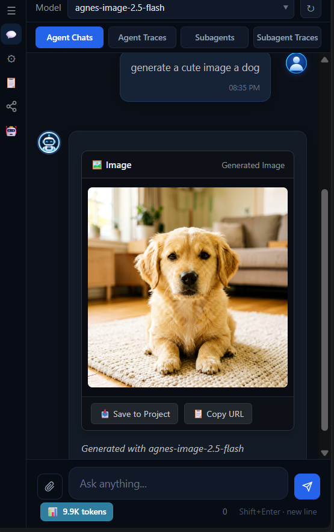

# CodeRun AI Agent 🚀

<p align="center">
  
</p>

[](https://marketplace.visualstudio.com/items?itemName=Bala-Siva-Ganesh.ai-agent)
[](https://marketplace.visualstudio.com/items?itemName=Bala-Siva-Ganesh.ai-agent)
[](https://nbsgr.github.io/coderun-agent/)
[](https://opensource.org/licenses/MIT)
[](https://nodejs.org)
[](https://github.com/nbsgr/coderun-agent/pulls)

**CodeRun AI Agent** (`AI-AGENT`) is a professional, multi-provider autonomous coding companion for Visual Studio Code. Built upon an advanced agentic loop, CodeRun acts as an intelligent pair programmer capable of reading, writing, and editing files, indexing codebases in a high-speed local SQLite database, running interactive terminal processes, applying precision diffs, and orchestrating multi-step execution plans.

Whether you are running completely offline with local models via **Ollama**, leveraging official API keys (**OpenAI**, **Anthropic Claude**, **Google Gemini**, **Groq**, **OpenRouter**, **xAI Grok**), or routing custom endpoints (**Cloudflare Workers AI**, **vLLM**, **LM Studio**, **Aero Link**), CodeRun delivers a deeply integrated, robust, and secure developer experience.

> 📖 **Official Live Documentation & Architecture Guide:** [https://nbsgr.github.io/coderun-agent/](https://nbsgr.github.io/coderun-agent/)

---

## 🧭 Current Engineering Contract & Coding Standards

The repository follows a deliberately small, modular JavaScript architecture designed for maximum reliability and failure containment:

### 📐 Coding Style Rules
* **Plain ES JavaScript only:** Application, webview, script, and test implementations use `.js` or `.cjs`; there is no TypeScript, JSX, or transpilation build layer.
* **Strict Traditional Function Declarations:** All functions use named `function name() {}` declarations. 
* **Disallowed Syntax Patterns:**
  * **No Arrow Functions:** Arrow functions (`=>`) are strictly prohibited in runtime code, utilities, and tests.
  * **No IIFEs:** Immediately Invoked Function Expressions (`(function() {})()`) are not used.
  * **No Assigned Function Expressions:** Variable-assigned function expressions (`var foo = function() {}`) are prohibited; use named function declarations instead.
  * **No `.bind()`:** JavaScript function `.bind()` is not permitted. *(Intentional SQL.js exception: `projectKnowledge.js` calls SQL.js prepared-statement `.bind(params)` to bind query parameters. This is a database API call, not JavaScript function binding).*
  * **No `class` Keyword:** Object factories, prototypes, and plain object literals are used instead of ES classes.
  * **No JSDoc `@param` tags:** Function contracts are self-documenting through clean parameters and inline commentary rather than JSDoc tags.

### 🏗️ Modular Engine Architecture (Blast Radius Containment)
The agent runtime decomposes responsibilities away from a monolithic loop into specialized, isolated engines behind stable interfaces:
* **`src/agents/agentLoop.js` (Orchestrator):** Lightweight loop driver coordinating model stream responses, tool execution, and session state transitions.
* **`src/tools/toolExecutor.js` (Execution Engine):** Manages `executeSingleToolCall`, robust argument parsing with markdown fence stripping and concatenated JSON recovery, permission gating, step verification, and automated recovery actions.
* **`src/agents/contextEngine.js` (Context Engine):** Encapsulates startup context assembly (project knowledge, active plans, timeline, and MCP contexts) and dynamic per-iteration system prompt rebuilds.
* **`src/agents/delegationEngine.js` (Delegation Engine):** Manages background subagent tracking, completion harvesting, blocking wait loops, and natural-language delegation rationale text.
* **`src/agents/mediaRuntime.js` (Media Runtime):** Handles direct image and video model generation pre-flight, routing non-chat models directly to `/v1/images/generations` and `/v1/videos` with isolated disk persistence.
* **`src/agents/decisionEngine.js` (Decision Engine):** Forces a concluding LLM response when tool execution completes as the last message in conversation history.
* **`src/agents/toolContextBuilder.js` (Tool Context & Hygiene):** Pure utility library constructing tool context objects and detecting loop hygiene issues (repetitive tool calls, consecutive failures).
* **`src/agents/agentState.js` (State Machine):** Formal finite state machine with atomic `transitionWithTrace` to enforce valid state progressions and record transition telemetry.

### 🔒 Operational Boundaries
* **Session ownership is explicit:** Agent state, permissions, terminal sessions, diffs, checkpoints, and traces are keyed by conversation/session ID.
* **Terminal states are authoritative:** A completed run cannot be changed to stopped or failed by late cleanup. A genuine stop is finalized as `stopped` and receives a terminal trace update.
* **Trace fidelity is preserved:** Execution traces record LLM calls, tool calls, decisions, transitions, observations, final responses, status, duration, and persisted history. The UI does not infer successful completion from an incomplete tool-call history.
* **Focused validation is standard:** Run `npm test` for the 80-group regression suite and use `node --check <file>` when changing JavaScript syntax or webview code.

These rules apply to source, scripts, and tests. Generated artifacts and test fixtures may contain other languages or literal syntax used to test parsing and file-handling behavior.

---

## 🌟 Key Highlights & Features

### 🤖 Multi-Provider Model Orchestration
*   **8 Native Providers Supported:** Ollama, OpenAI, Anthropic Claude, Google Gemini, Groq, OpenRouter, xAI (Grok), and custom OpenAI Compatible endpoints.
*   **Intelligent Media Routing & Persistent Storage:** Automatically classifies image and video models (such as `agnes-image-*`, `dall-e-*`, `flux`, `sdxl`, `agnes-video-*`, `sora`, `kling`, `runway`, `minimax`) using provider metadata inspection and keyword heuristics. Routes media generation requests directly to `/v1/images/generations` and `/v1/videos` instead of chat completions to prevent HTTP 400 errors.
*   **Native Zero-Dependency HTML5 Video Player:** Generated videos render with a built-in interactive HTML5 player:
    *   **Play / Pause Toggle:** Click the player button or click directly on the video screen.
    *   **Skip ±10 Seconds:** Quick rewind (`⏪ -10s`) and forward (`⏩ +10s`) buttons.
    *   **Draggable Progress Scrubber:** Responsive range slider with real-time progress fill bar tracking watched time.
    *   **Timestamps & Display Controls:** Monospace current/duration time indicators (`0:05 / 0:30`), Volume Mute toggle (`🔊`/`🔇`), and Fullscreen toggle (`⛶`).
*   **Storage Isolation & Manual "Save to Project":**
    *   **Zero Workspace Pollution:** Generated media is saved strictly into VS Code's persistent `globalStorageUri/media/` folder for chat history persistence. It is **never** saved directly into your workspace automatically.
    *   **Manual Export On-Demand:** Clicking the **"📥 Save to Project"** button on any media card copies the file into `<workspace>/assets/<fileName>` and displays a VS Code notification with an **"Open File"** action.
*   **Adaptive Self-Healing & Async Task Polling:** Automatically adapts payloads if an endpoint requires `mode: 'text'`, polls asynchronous video generation tasks across standard and custom routes, and automatically retries with exponential backoff on HTTP 503 `video_queue_full` errors.
*   **Differentiated Request Timeouts (Local-First vs Cloud):**
    *   **Local LLMs (Ollama / Localhost / 127.0.0.1 / :11434):** Generous **10-Minute Timeout (600,000 ms)** allowing local models ample time for cold weight loading and extended inference without premature "Request timed out." errors.
    *   **Remote Cloud Providers (OpenAI, Anthropic, OpenRouter, Groq):** **30-Second Timeout (30,000 ms)** for prompt network failure detection.
    *   **Automatic Detection:** Automatically identifies local runtimes via `isLocalEndpoint(config)`.
*   **Saved Provider Configurations:** Save credentials (API keys, base URLs, default models) for multiple endpoints. Switch models on the fly in the middle of a chat session without resetting settings.
*   **Unified Model Dropdown:** All models from your active and saved providers are dynamically retrieved and presented in a single, clean dropdown, grouped logically by provider.
*   **API Type Selection:** Custom compatible providers support setting the underlying **API Type** (**OpenAI Compatible**, **Anthropic Compatible**, or **Google Gemini Compatible**) to correctly format request bodies, endpoint paths, and API headers.
*   **Cloudflare Workers AI Support:** Dynamically parses Cloudflare base URLs to extract your Account ID and retrieve model lists using Cloudflare's search API.
*   **Google Gemini Protobuf & Schema Sanitization:** Automatic schema normalization recursively strips unsupported JSON Schema keywords (`additionalProperties`, `$schema`, `title`, `$defs`, `definitions`) before submitting to Gemini endpoints, preventing HTTP 400 rejection on complex schemas (such as Puppeteer browser tools). Automatically normalizes model names to prevent HTTP 404 lookup failures.

### 💻 Interactive Terminal Execution & Dual Terminal Architecture
*   **Dual Dedicated Terminal Sessions per Chat:** Every chat maintains two isolated, visible VS Code terminal sessions:
    *   **`CodeRun(main)`**: Dedicated direct/foreground terminal executing standard CLI commands, tests, builds, and interactive REPLs with real-time output streaming.
    *   **`CodeRun(BG)`**: Dedicated background terminal running persistent dev servers (`npm run dev`, `vite`, `python -m http.server`, daemons) with real-time output streaming and automatic localhost URL/port sniffing.
*   **Full Interactive Session Lifecycle:** Launch interactive REPLs (Node, Python, Ruby, MySQL, npm init, etc.) with `run_terminal` (`interactive: true`).
*   **Live Keystroke Delivery:** Send commands and inputs dynamically to active sessions using `terminal_input`, with clean multi-line and escape character normalization.
*   **Selective Terminal Interrupts (`stop_terminal`):** Send clean interrupt signals (`\u0003` / `Ctrl+C`) to active terminals with granular target selection:
    *   `target: "foreground"` (default): Interrupts hanging foreground commands or tests in `CodeRun(main)` without terminating background dev servers.
    *   `target: "background"`: Gracefully terminates dev servers and daemons in `CodeRun(BG)` without disturbing foreground shell state.
    *   `target: "all"`: Aborts active executions across both terminals simultaneously.
*   **UI Transparency & Distinguishable Badging:** Chat UI terminal cards display real-time output logs and feature clear visual badges:
    *   Emerald badge and header prefix: `[CodeRun(main)]`
    *   Indigo badge and header prefix: `[CodeRun(BG)]`
*   **Smart Prompt Detection:** Accurately detects interactive question prompts (e.g. `(y/N)`, `Password:`, `>>>`) while filtering out standard idle shell prompts (`PS ...>`, `user@host:~$`).
*   **ANSI Escape Cleaning:** All ANSI escape sequences, OSC markers, and VS Code shell integration codes are stripped before rendering.

### 📋 Real-Time Checklist & Todo Tracking
*   **Cognitive Brain/Body Architecture:** The LLM serves as the cognitive brain creating and updating plans; the runtime faithfully tracks and renders progress.
*   **Live Progress Bar:** The composer displays a live `Todos (X/Y)` bar reflecting in-progress `[/]` and completed `[x]` tasks as each step finishes.
*   **Graceful Auto-Hide on Completion:** When all tasks finish (`Todos (13/13) ✓`), the panel confirms completion and smoothly fades out after 5 seconds to keep the workspace clean.
*   **Collapsible & Inspectable:** Click the Todos header anytime to expand and review all checklist steps.

### 💬 Interactive User Questions (`ask_question`)
*   **Proactive Clarification Prompts:** When encountering ambiguous architectural decisions or missing configuration values, CodeRun pauses and presents interactive question banners directly in the chat.
*   **Clickable Option Chips & Write-In:** Choose from pre-configured single or multi-select chips with real-time visual selection indicators, or type custom freeform answers.
*   **Non-Blocking & Session-Isolated:** Question lifecycles are strictly session-isolated in `questionManager.js`, with seamless auto-focus and keyboard submission.

### 🧠 Advanced Agent Loop & Concurrency
*   **Think → Plan → Act → Verify:** Multi-iteration loop executing tool actions, verifying outputs, and learning repository patterns.
*   **Parallel Concurrency for Read-Only Tools:** Concurrent execution of independent read and search operations (`read_file`, `search_files`, `find_in_files`, `get_file_info`) via `Promise.all` for maximum speed.
*   **Per-File Mutation Serialization:** Atomic file write locking via `fileLockManager.js` ensures sequential safety during concurrent writes.
*   **Repetitive Failure Circuit Breaker:** Automatically detects repeated tool failures on identical arguments, halting loops and prompting reflection.
*   **Zero-Latency Reasoning Stream:** Real-time synchronous token extraction and rendering for reasoning models (DeepSeek-R1, Gemma 4, o3-mini) in collapsible **Thought Process** blocks with live auto-scroll.
*   **Persistent User Dropdown Retention:** User-opened dropdowns stay open across multi-step execution loops until manually collapsed by the user, while reloaded conversations start cleanly collapsed.
*   **Signal Cancellation & Safe Stop:** Abort signals propagate cleanly into active tool invocations, auto-retries, and recovery steps without race conditions.

### 🧩 Native VS Code LSP & Diagnostic Self-Reflection
*   **VS Code Language Server Commands (`src/tools/tools.js`):** Interacts directly with VS Code's internal language provider commands:
    *   `get_definition`: Invokes `vscode.commands.executeCommand('vscode.executeDefinitionProvider', uri, position)`. Returns the definition file path, line, character, and line preview. If the provider returns no results (or runs outside VS Code), falls back to cursor token extraction and local symbol lookup via `symbolParser.js`.
    *   `find_references`: Invokes `vscode.commands.executeCommand('vscode.executeReferenceProvider', uri, position)`. Returns all referenced locations with file paths, lines, characters, and preview snippets, with regex workspace fallback.
    *   `document_symbols`: Invokes `vscode.commands.executeCommand('vscode.executeDocumentSymbolProvider', uri)`. Recursively formats symbols into hierarchical objects with name, SymbolKind string (`Class`, `Method`, `Function`, `Variable`, etc.), and start/end line bounds. Falls back to regex-based symbol parsing if uninitialized.
*   **Compiler & LSP Diagnostic Inspection (`src/execution/reviewEngine.js`):**
    *   In the self-reflection review phase, `checkCompilerDiagnostics()` queries `vscode.languages.getDiagnostics(uri)` for modified files.
    *   Filters specifically for `DiagnosticSeverity.Error` (severity `0`), capturing file path, line number, source name, and error message to fail review audits if code modifications introduce syntax or compiler breaks.
*   **Embedded SQLite Knowledge Base (`src/context/projectKnowledge.js`):**
    *   Maintains a WebAssembly-based SQLite database (`index.db`) powered by `sql.js` in `globalStorageUri/projects/<Name_Hash>/` tracking indexed files, text chunks, metadata, and parsed symbols.
    *   **`query_project_db` Tool:** Allows executing read-only `SELECT` SQL queries against this local database (strictly rejects any mutation statements like `INSERT`, `UPDATE`, `DELETE`, `DROP`).

### 🛡️ Clean Error Boundary & Dynamic Auto-Sizing
*   **Dynamic Card Sizing:** Error notification cards automatically adapt their height and width to fit the exact volume of text and diagnostic details without awkward clipping.
*   **Complete Boundary Containment:** Long uninterrupted URLs (e.g. Google API rate limit links, stack traces) and JSON payloads wrap cleanly using `overflow-wrap: anywhere` and `word-break: break-word`, preventing text from spilling outside the red card boundaries.
*   **Top-Aligned Status Icons:** The error icon is neatly pinned to the top-left of multi-line error blocks rather than floating vertically in the center.
*   **Deduplicated Error Pipeline:** Webview error handling unifies internal agent loop events and terminal stream failures, stripping redundant `"Error: "` prefixes and preventing duplicate stacked error cards.

### 🔍 Diff Management & Approval Pipeline
*   **SHA-256 Optimistic Concurrency:** Stages proposed file changes in memory with baseline SHA-256 hashing to prevent overwriting external disk edits.
*   **Auto-Open Inline Webview Diffs:** Diffs (`<details class="cr-diff-details">`) open by default during permission checks and tool executions so users immediately review file changes before approving/rejecting, automatically collapsing upon resolution.
*   **Side-by-Side Editor:** Inspect additions (green) and deletions (red) directly inside chat cards or launch native side-by-side VS Code diff editors.
*   **Single-Click Batch Operations:** Accept or reject individual diffs or click **Accept All** / **Reject All** in the agent controls bar.

### ↩️ Database-Backed Snapshots & Checkpoints
*   **SQLite-Powered Snapshots:** Snapshots files into a local SQLite database (`index.db`) before any mutation.
*   **Single-Click Undo:** Real-time **Undo** buttons appear directly under assistant responses for instant rollback.
*   **Command Palette Integration:** Run `CodeRun: Undo Last Edit` at any time.

### 📦 0ms Local Context Compaction & Checkpoint Cards
*   **Deterministic Local Compaction:** Automatically compacts verbose conversational turns, inspection tools, and directory listings into concise status summaries (`Read file`, `Wrote file`, `Patched file`) with 0ms execution time and zero token costs.
*   **Turn Range Boundaries:** Displays explicit turn boundary counters `(Turns 1 - N)` on the checkpoint bubble header, protected against overflow or truncation.
*   **Unified Native Tool Card Styling:** Collapsible sub-sections use the project's native card design (`.cr-tool-card.cr-cp-card`) with dark backgrounds (`#0b0f17`), subtle borders, inline icons, timing metadata, and rotating chevrons:
    *   💬 **User Message (N):** Expands to show formatted user inputs.
    *   🕒 **Thought Process:** Captures model thinking steps with duration timing.
    *   🔧 **Tool Calls (N):** Shows full executed tools table with tool names, parameters, execution times, and success/failure badges, immune to boundary overflow on long names.
    *   ✨ **Response Summary:** Completely preserves the model's full final response, numbered lists, and instructions without premature truncation.
*   **Instant Local Execution:** Runs 100% on the client machine without external LLM summarization API overhead.

### ⚡ Multi-Turn Context Optimization & Historical Tool Compaction
*   **Active Turn Full-Fidelity:** In the active agent loop iteration, tools like `read_file` and `run_terminal` deliver complete, raw outputs so the LLM has full fidelity to reason, analyze code, and execute changes.
*   **Automatic Historical Compaction:** In subsequent conversation turns, historical inspection, search, and terminal outputs are automatically compacted into lightweight status lines (e.g. `✅ Read file 'main.py' successfully` or `✅ Command 'npm test' executed successfully (exit code 0)`), reducing context payload by up to 90%.
*   **Selective Failure & Mutation Retention:** If any tool fails, the complete error message, stack trace, and exit codes are preserved in full so the model remembers what went wrong. Code mutation tools (`write_file`, `edit_file`, `patch_file`, `delete_file`) retain full responses and diff details.
*   **100% Wire Protocol & UI Integrity:** Historical tool call schemas and `tool_call_id` pairing remain strictly compliant with OpenAI, Anthropic, Gemini, and Ollama specifications. Webviews, real-time tool cards, execution traces, checkpoints, and SQLite logs retain complete, unadulterated history.
*   **Local LLM Immunity:** Completely eliminates context saturation crashes and VRAM swapping on local Ollama models (such as Qwen 2.5 Coder or DeepSeek-R1) with 8K–32K context limits.

### 🪵 Real-Time Visual Execution Traces
*   **Dual View (`[Chats]` / `[Traces]`):** Switch between conversational chat and an interactive step-by-step trace graph.
*   **Detailed Step Diagnostics:** Inspect exact system prompts, LLM decisions, duration in milliseconds, inputs, and outputs per step.
*   **One-Click Export:** Copy individual step data or export the full run JSON to clipboard.

### 📜 Global & Workspace Rules Engine
*   **Hierarchical Rule Precedence:** Define Global Rules (`~/.coderun/rules`) that apply everywhere across all projects, and Workspace Rules (`.coderunrules`) scoped to the active repository.
*   **Integrated Code-Style Editor:** In-app editor with dynamic line number gutters, synchronized scrolling, one-click open in VS Code, and instant `Ctrl + S` saving.

### 🔄 Tool Lifecycle State Sync
*   **Reliable Lifecycle Transitions:** Every tool follows the exact lifecycle: PENDING → WAITING_FOR_PERMISSION → RUNNING → COMPLETED/FAILED/CANCELLED. No tool card remains stuck in RUNNING.
*   **Provider-Compatible Card Linking:** Cards are stored under multiple key aliases (toolCallId, index key, toolName key), ensuring `tool_result` events find the correct card regardless of whether the LLM provider emits tool call IDs or not.
*   **Backwards DOM Fallback:** When lookup keys fail, the DOM search iterates backwards to find the most recently created card — fixing issues where multiple calls of the same tool (e.g., two `update_plan` invocations) would update the wrong card.

### 📊 Live Context Window & Monotonic Token Tracking
*   **Monotonic Cumulative Token Accumulation:** Token counts strictly accumulate across all conversational turns and tool iterations. Total Consumed never decrements or resets when continuing conversations.
*   **Live Context Window Gauge:** Real-time visual progress bar and token ratio (`X / Y (Z%)`) indicating the model's active context window occupancy.
*   **Saturation Alerts:** Progress bar dynamically shifts from normal blue to amber warning (`≥70%`) and critical red (`≥90%`) as the context fills, alerting you before hitting model limits.
*   **Dynamic Context Limit Discovery:** Automatically fetches accurate context window sizes (`context_length`, `context_window`, `inputTokenLimit`) directly from provider APIs (OpenRouter, Groq, Ollama, Gemini) via raw REST discovery, with heuristic architectural fallbacks.
*   **Detailed Session Info Modal:** Click the token badge anytime to inspect Total Consumed, active Context Window usage, Input / System tokens, Output / Response tokens, and trigger 1-click conversation compaction.

### 📦 Transparent User Sandbox Directory & Terminal CWD Synchronization
*   **Dedicated Isolated Workspace:** Transparently provides a dedicated scratch sandbox directory at `~/.coderun/sandbox/` alongside the main workspace.
*   **Automatic Terminal CWD Synchronization:** When running terminal commands targeting sandbox files or test scripts, CodeRun automatically sets the terminal working directory (`cwd`) to `~/.coderun/sandbox/`, allowing relative script and tool execution without dirtying the repository.
*   **Built-in Path Isolation & Security:** All standard file operations (`read_file`, `write_file`, `edit_file`, `patch_file`, `delete_file`) natively accept paths inside the user sandbox directory, with automatic path canonicalization and directory traversal protection.
*   **Dedicated `sandbox` Management Tool:** Inspect sandbox status, list sandbox contents, or clean temporary files on demand (`action: 'status' | 'list' | 'clean'`).

### 🎭 On-Install Browser Setup & Zero-Config Puppeteer MCP
*   **Local Browser Auto-Detection:** Automatically discovers installed Google Chrome, Microsoft Edge, Brave, and Chromium executables across Windows, macOS, and Linux.
*   **Zero-Friction Fallback Installation:** If no system browser is found, CodeRun automatically installs a lightweight, dedicated Chromium binary into `~/.coderun/browser/` on first run via `@puppeteer/browsers`—completely eliminating runtime browser missing errors.
*   **Dual-Resolution Tool Aliases:** MCP tools resolve seamlessly whether invoked with full namespaced names (`mcp__puppeteer__puppeteer_navigate`) or direct aliases (`puppeteer_navigate`), preventing "Tool not found" execution stalls across different LLM providers.

### 🔌 Model Context Protocol (MCP) & Extensibility
*   **Full MCP Client Integration:** Seamless stdio-based Model Context Protocol client with capability negotiation, automated tool schema extraction, and dynamic registration into the agent loop.
*   **Built-in Server Catalog:** Pre-configured support for Web Fetcher (`web-fetch`), Memory Graph (`memory`), GitHub (`github`), and Puppeteer (`puppeteer`).
*   **Zero-Config Browser Automation:** Embedded system browser discovery automatically locates installed Google Chrome, Microsoft Edge, Brave, or Chromium binaries across Windows, macOS, and Linux — no manual browser installation needed.
*   **Custom MCP Server Management:** Register arbitrary custom MCP servers directly from the Settings view with per-tool permissions and toggle controls.

### 🤖 Autonomous Subagent Workers & Multi-Agent Delegation
*   **Hierarchical Task Delegation:** Spawn child AI agents with `spawn_subagent` to tackle independent subtasks (architecture planning, code generation, test verification, security review) concurrently or synchronously.
*   **Dual Execution Modes:**
    *   `sync` / `parallel` / `async`: Launches subagents in the background non-blocking, immediately returning confirmation while the child agent works in parallel with the main agent. The main agent can concurrently run terminal commands or perform inspections while the subagent runs.
    *   `wait`: Synchronously blocks until the subagent completes its full loop and delivers verified final results back to the parent session.
*   **Tool Isolation & Anti-Recursion Safety:** Subagents are provisioned with full workspace manipulation tools (`create_folder`, `write_file`, `edit_file`, `read_file`, `run_terminal`, etc.) while subagent delegation tools are filtered out, strictly preventing runaway recursive spawning loops.
*   **Per-Action Checkpointing & Instant Undo Rollback (`↩ Undo`):** File creation, writing, and editing operations by subagents generate automatic snapshot checkpoints with single dedicated `↩ Undo` buttons under approved diff cards.
*   **Bi-Directional Undo Reflection Across All Views:** Undoing a checkpoint (from the main chat diff card or the Subagents tab) immediately transitions the card status to `✓ RESTORED` / `✓ Restored` across open views, subagent execution chat, traces, and backend storage.
*   **Full Subagent Lifecycle Management:** Complete toolset to control running subagents: `subagent_status` (inspect progress, active steps, read/written files), `subagents_list` (session-wide subagent registry), `stop_subagent` (graceful termination), and `wait_for_subagent` (join async subagents).
*   **Dedicated Subagent Settings Panel (`🤖`):** Access dedicated Subagent Settings via the robot emoji (`🤖`) on the navigation rail to configure provider, model, and execution limits independently of the main chat agent.
*   **Saved Providers Selection:** Subagent provider dropdown lists only saved, verified provider configurations (e.g. Ollama, OpenAI-compatible endpoints) rather than unconfigured generic endpoints, with `(Inherit from Main Agent)` as the default.
*   **Model Combobox with Instant Search:** Full-featured searchable model combobox matching the main chatspace with sticky search bar (`🔍 Search models...`), collapsible provider groups, and active checkmark badges (`✓`).
*   **Automatic Model Inheritance:** Selecting `(Inherit from Main Agent)` automatically syncs the subagent model to inherit the main agent's active model in real time.
*   **Distinct Checkpoint & Trace Attribution:** Checkpoints, file modifications, and execution traces are attributed to unique subagent IDs (`agentId`), enabling isolated rollbacks and dedicated Subagent Traces inspection.

### 🎨 Intelligent Image & Video Generation & Persistent Media Storage

<p align="center">
  
</p>

*   **Dual-Strategy Modality Classification:**
    *   **Strategy 1 (Provider Metadata Inspection):** Automatically inspects model metadata returned by OpenAI, OpenRouter, and OpenAI-compatible providers (examining `type`, `modalities`, `architecture.modality`, and `task`) to determine whether a model is intended for text chat, image generation, video generation, or embeddings.
    *   **Strategy 2 (Keyword Token Heuristics):** Fallback token analysis identifies models from their ID or alias (detecting `video`, `sora`, `kling`, `runway`, `image`, `dall-e`, `imagen`, `flux`, `sdxl`, `embed`, `audio`), ensuring unannotated custom proxies like `agnes-image-2.5-flash` or `agnes-video-2.5` route properly without manual configuration.
*   **Two-Layer Execution Safeguard & Self-Healing:**
    *   **Pre-Flight Direct Media Dispatch:** When a model is known to be an image or video model, the agent bypasses standard chat completion (`/v1/chat/completions`) entirely and dispatches the user's prompt directly to `/v1/images/generations` or `/v1/videos`.
    *   **Runtime Self-Healing Recovery:** If an uncatalogued model is called via chat and the upstream server responds with HTTP 400 (e.g. `"Model X is an image model. Use /v1/images/generations"` or `"Model Y is a video model. Use /v1/videos"`), CodeRun catches the error, parses the target endpoint, re-routes the prompt to the appropriate media pipeline, and presents the generated asset seamlessly.
*   **Persistent Storage in VS Code `globalStorage`:**
    *   **URL Expiration Elimination:** Cloud providers frequently return short-lived signed URLs (SAS tokens expiring within 60 minutes). CodeRun immediately downloads remote media assets and writes them to `<globalStorageUri>/media/`.
    *   **Zero `localStorage` Bloat:** Large base64 data payloads are saved directly as binary files (`.png`, `.jpg`, `.mp4`, `.webm`) on disk instead of congesting browser `localStorage`, preventing the 5MB browser storage quota limit from ever being exceeded.
    *   **Secure Webview URI Resolution:** Local media paths are transformed via `webview.asWebviewUri(vscode.Uri.file(filePath))` for smooth, sandboxed display inside VS Code webviews.
*   **Interactive Chat UI Cards & Built-in HTML5 Player:**
    *   Images and videos render inside `.cr-media-card` components with subtle border styling, responsive aspect ratios, and full playback controls for videos.
    *   **Zero-Dependency HTML5 Video Player:** Includes ▶/⏸ play/pause, ⏪ -10s rewind, ⏩ +10s forward, a draggable range progress scrubber with real-time fill tracking, current/duration timestamps (`0:05 / 0:30`), volume mute, and fullscreen toggle.
    *   **"Save to Project" Button:** Copies the asset from isolated global storage into `<workspace>/assets/<fileName>` on demand with a notification and "Open File" action.
    *   **"Copy URL" Button:** Copies the resource URI or path directly to your clipboard for quick sharing.
*   **Visual Modality Badges & Adaptive Input:**
    *   The model dropdown visually tags models with modality icons (`🖼️ Image`, `🎬 Video`, `🔍 Embed`).
    *   Selecting an image or video model dynamically adapts the chat composer placeholder (e.g., `"Describe the image you want to generate..."`), guiding user interaction.
*   **Native Agent Media Tools (`generate_image`, `generate_video`):**
    *   Agents can autonomously generate visuals, UI mockups, and video assets during execution loops using the registered `generate_image` and `generate_video` tools.

---

## 🏛️ Architecture and Features

Key architectural design decisions, technical capabilities, and built-in subsystems powering **CodeRun AI Agent**:

| Feature / Capability | Architectural Design | Implementation & Highlights |
| :--- | :--- | :--- |
| **Modular Engine Architecture** | Decomposed runtime across 7 specialized engines (Context, Delegation, Tool Execution, Media, Decision, ContextBuilder, StateMachine) | ✅ **Failure Containment** reducing agentLoop by 50% to a pure coordinator |
| **Multi-Provider Support** | Modular provider adapters in `src/providers/` with unified normalization & streaming | **8 Providers** (Ollama, Gemini, OpenAI, Claude, Groq, OpenRouter, xAI, Custom) |
| **100% Free & Local (Ollama)** | Native Ollama streaming adapter with model context length discovery | ✅ **Native** streaming, vision & context autodiscovery |
| **Transparent User Sandbox** | Dedicated user sandbox directory (`~/.coderun/sandbox/`) with automatic CWD sync | ✅ **Native** isolated execution without polluting workspace git repo |
| **On-Install Browser & Puppeteer MCP** | Embedded browser discovery in `src/mcp/mcpManager.js` + Puppeteer MCP server | ✅ **Auto-detects Chrome/Edge/Brave** or installs Chromium with screenshot capture |
| **Persistent Memory Graph MCP** | Built-in stdio-based knowledge graph server (`src/mcp/builtinServers/memoryGraphServer.cjs`) | ✅ **Pre-configured built-in catalog** for cross-session entity & relation tracking |
| **Media Model Routing & Persistence** | Dual-strategy classifier in `src/providers/modelClassifier.js` + `src/media/mediaManager.js` | ✅ **Automatic routing** to `/v1/images/generations` and `/v1/videos` with persistent disk storage in VS Code `globalStorage` |
| **Deterministic Context Compaction** | Local 0ms checkpoint generator (`src/context/compactionManager.js`) | ✅ **0ms Instant Local Checkpoints** with zero external API calls or token cost |
| **Historical Tool Compaction** | Wire-protocol optimizer in `src/context/contextManager.js` | ✅ **Automatic** reduction of old tool turns by up to 90% while retaining full active outputs & failure diffs |
| **Local SQLite Codebase Index** | Embedded SQL.js database (`src/context/projectKnowledge.js`) with serialized disk persistence | ✅ **Embedded SQL.js** for fast local symbol & file indexing with zero cloud upload |
| **Interactive Terminal REPLs** | VS Code Terminal API bridge with shell integration & prompt detection (`src/tools/terminalManager.js`) | ✅ **Full lifecycle** (`terminal_input`, prompt detection, `stop_terminal` Ctrl+C) |
| **Dynamic Card Error Containment** | Dynamic card sizing & auto-wrapping CSS (`overflow-wrap: anywhere`) | ✅ **Auto-wrapping & no boundary overflow** on long uninterrupted URLs and JSON payloads |
| **Live Monotonic Token Tracking** | Real-time context window gauge with model limit store (`modelContextWindows`) | ✅ **Real-time saturation warnings** (proactive visual alerts at 70% and 90%) |
| **Interactive User Questions** | Session-isolated question lifecycle manager (`src/tools/questionManager.js`) | ✅ **`ask_question` with interactive option chips & custom write-in** |
| **Native VS Code LSP & Diagnostics** | Language Server Protocol integration in `src/tools/tools.js` & `src/execution/reviewEngine.js` | ✅ **Native LSP** (`get_definition`, `find_references`, `document_symbols`) + live compiler diagnostic self-healing |
| **Zero-Latency Reasoning & UI State** | Synchronous thinking stream & persistent user toggles in `src/ChatSpace.js` | ✅ **Instant auto-scroll** for reasoning models + dropdown state preservation across agent loops |
| **Autonomous Subagent Workers** | Hierarchical subagent runner in `src/agents/subagentManager.js` with dedicated tools | ✅ **Background (`sync`) & Synchronous (`wait`) delegation** with checkpoints, undo reflection & dedicated 🤖 settings |
| **Adversarial Regression Tests** | Standalone test harness (`test/runAllTests.js`) with 0 external dependencies | ✅ **80 Test Groups** covering concurrency, permissions, SSRF, locks, recovery, subagents, checkpoints, dual terminals & tools |


---

## 🧰 Complete Tool Matrix (33 Core Tools)

CodeRun exposes a curated set of **33 active core tools** organized across 9 operational categories. The LLM receives standard function calling schemas for these tools, while heavy index operations (such as SQLite indexing) run deterministically in the background.

| Category | Tool | Description | Dangerous / Permissions |
| :--- | :--- | :--- | :--- |
| **📁 File Operations** | `read_file` | Read complete file contents at a relative path or inside sandbox | No |
| | `write_file` | Create or overwrite a file with full diff preview | ⚠️ Yes |
| | `edit_file` | Find and replace a single exact string occurrence | ⚠️ Yes |
| | `patch_file` | Apply multiple search-and-replace edit blocks | ⚠️ Yes |
| | `delete_file` | Permanently delete a specified file | ⚠️ Yes |
| | `create_folder` | Create directory structure including parents | No |
| | `delete_folder` | Recursively delete a directory and its contents | ⚠️ Yes |
| | `get_file_info` | Get file metadata (size, lines, modified date, MIME) | No |
| **🔍 Search & Navigation** | `search_files` | Find files matching glob patterns (e.g. `*.js`, `src/**`) | No |
| | `find_in_files` | Search workspace file contents for text queries | No |
| | `list_symbols` | Parse classes, functions, and symbols with line numbers | No |
| | `get_definition` | Native VS Code LSP: Jump directly to symbol definition | No |
| | `find_references` | Native VS Code LSP: Find all references and call sites | No |
| | `document_symbols` | Native VS Code LSP: Extract complete file symbol hierarchy | No |
| | `list_directory` | List folder contents with recursive depth controls | No |
| **💻 Terminal Execution** | `run_terminal` | Execute shell commands in VS Code terminal (`CodeRun(main)` or background `CodeRun(BG)` with auto CWD sync for sandbox) | ⚠️ Yes |
| | `terminal_input` | Send input to an active interactive terminal session / REPL | ⚠️ Yes |
| | `stop_terminal` | Send `Ctrl+C` interrupt to abort a running command (`target: 'foreground' \| 'background' \| 'all'`) | No |
| **💬 Interaction** | `ask_question` | Ask user clarification questions with clickable choice chips or custom write-in | No |
| **📋 Planning & Progress** | `create_plan` | Initialize a structured task checklist | No |
| | `update_plan` | Update task statuses (`[ ]` pending, `[/]` in progress, `[x]` done) | No |
| **🎨 Media Generation** | `generate_image` | Generate images via `/v1/images/generations` and save to persistent storage | No |
| | `generate_video` | Generate videos via `/v1/videos` and save to persistent storage | No |
| **🤖 Subagents** | `spawn_subagent` | Launch an autonomous child agent in `sync` (background) or `wait` mode | ⚠️ Yes |
| | `subagent_status` | Inspect a child subagent's state, progress, and files read/modified | No |
| | `subagents_list` | List all active and completed child subagents in the session | No |
| | `stop_subagent` | Terminate a running or paused child subagent cleanly | ⚠️ Yes |
| | `wait_for_subagent` | Await an async background subagent until terminal completion | No |
| | `subagent_response` | Received subagent execution response and results | No |
| **🌐 Utilities & Web** | `web_request` | Perform HTTP requests (GET, POST, PUT, DELETE) | No |
| | `get_current_datetime` | Retrieve current date and time in ISO format | No |
| **📦 Utilities & Sandbox** | `sandbox` | Inspect, list, or clean the transparent user sandbox directory (`~/.coderun/sandbox/`) | No |
| **🗄️ Database** | `query_project_db` | Execute safe read-only SQL queries on the project knowledge database | No |

### 🔌 Model Context Protocol (MCP) Dynamic Tools
When MCP servers are enabled in Settings, their tools dynamically register into the agent's active schema with namespaced IDs and direct aliases:

| MCP Server | Dynamically Registered Tools | Capabilities |
| :--- | :--- | :--- |
| **🌐 Web Fetcher** (`web-fetch`) | `mcp__web-fetch__fetch_web_content`, `mcp__web-fetch__http_get` | Headless page fetching, HTML-to-markdown conversion, web extraction |
| **🧠 Memory Graph** (`memory`) | `mcp__memory__create_entities`, `mcp__memory__create_relations`, `mcp__memory__read_graph`, `mcp__memory__search_nodes`, `mcp__memory__open_nodes` | Persistent knowledge graph storing facts, entities, and observations across sessions |
| **🐙 GitHub** (`github`) | `mcp__github__create_or_update_file`, `mcp__github__search_repositories`, `mcp__github__get_issue`, `mcp__github__create_pull_request`, ... | Full GitHub API repository, issue, commit, and pull request manipulation |
| **🎭 Puppeteer** (`puppeteer`) | `mcp__puppeteer__puppeteer_navigate`, `mcp__puppeteer__puppeteer_screenshot`, `mcp__puppeteer__puppeteer_click`, `mcp__puppeteer__puppeteer_fill`, `mcp__puppeteer__puppeteer_select`, `mcp__puppeteer__puppeteer_hover`, `mcp__puppeteer__puppeteer_evaluate` (aliases: `puppeteer_*`) | Full browser automation using local Chrome/Edge/Brave or auto-installed Chromium in `~/.coderun/browser/` with screenshot capture |
| **⚙️ Custom MCP Servers** | Custom tool names dynamically imported | Any stdio-based MCP server configured in Settings |

---

## 🛠️ Supported Providers

| Provider | Default Base URL | Keys Required | Vision Support | Common Models |
| :--- | :--- | :--- | :--- | :--- |
| **Ollama** | `http://localhost:11434` | No | ✅ `images` Array | `deepseek-r1`, `qwen2.5-coder`, `llama3.3`, `llava` |
| **OpenAI** | `https://api.openai.com/v1` | Yes | ✅ `image_url` Blocks | `gpt-4o`, `gpt-4o-mini`, `o3-mini` |
| **Anthropic** | `https://api.anthropic.com/v1` | Yes | ✅ `image` Source Blocks | `claude-3-7-sonnet`, `claude-3-5-sonnet` |
| **Google Gemini** | `https://generativelanguage.googleapis.com/v1beta` | Yes | ✅ `inline_data` Parts | `gemini-2.5-flash`, `gemini-1.5-pro` |
| **Groq** | `https://api.groq.com/openai/v1` | Yes | ✅ `image_url` Blocks | `llama-3.3-70b-versatile`, `deepseek-r1-distill-llama-70b` |
| **OpenRouter** | `https://openrouter.ai/api/v1` | Yes | ✅ `image_url` Blocks | 200+ vision & reasoning models |
| **xAI (Grok)** | `https://api.x.ai/v1` | Yes | ✅ `image_url` Blocks | `grok-2`, `grok-2-vision` |
| **OpenAI Compatible** | Custom | Optional | ✅ `image_url` Blocks | LM Studio, vLLM, LocalAI, Cloudflare |

---

## 🚀 Quick Start

### 1. Installation
Install **"CodeRun AI Agent"** via the Extensions view (`Ctrl+Shift+X`) in VS Code, or install it using the command-line interface:
```bash
code --install-extension Bala-Siva-Ganesh.ai-agent
```

### 2. Development Setup (From Source)
```bash
# Clone the repository
git clone https://github.com/nbsgr/coderun-agent.git
cd coderun-agent

# Install dependencies
npm install

# Run the complete test suite
node test/runAllTests.js

# Launch Extension Host in VS Code: Press F5
```

### 3. Basic Configuration
1. Open the CodeRun panel by clicking the robot icon in the Activity Bar.
2. Click the **⚙️ Settings** button.
3. Select your desired **Provider** (e.g. Ollama, Gemini, OpenAI, Anthropic).
4. Enter the **Base URL** (or use defaults) and paste your **API Key**.
5. Click **Refresh Models** to fetch your model list.
6. Select a model and click **Save Settings**.

---

## 🧪 Adversarial Test Suite

CodeRun features a comprehensive test harness (`test/runAllTests.js`) covering **80 adversarial test groups** with 0 external dependencies:
* Session isolation across terminal instances and permission choices.
* Concurrency protection via SHA-256 optimistic locking and hierarchical file locks.
* SSRF protection blocking all private and loopback subnets.
* Token and secret redaction (JWTs, API keys, database URLs, AWS credentials).
* Checkpoint restoration, directory tree preservation, and cross-session diff safety.
* Signal cancellation and max iterations lifecycle.
* Interactive command & REPL prompt detection across shells.
* Terminal tool execution approval, safe command policies, and interactive terminal lifecycle.
* MCP protocol handshake, dynamic tool discovery, permission authorization, and runtime tool execution.
* Historical tool result optimization, failure retention, mutation diff preservation, and active iteration raw output fidelity.
* Deterministic conversation compaction checkpoint resolution, tool argument mapping, complete response retention, and clean text boundaries.
* Interactive user questions (`ask_question`) lifecycle, option selection, write-in support, and session-isolated resolution.
* Subagent identity hierarchy, tool filtering, and recursive spawn prevention.
* Subagent state machine lifecycle transitions (running, paused, resumed, stopped, completed, failed).
* Checkpoint and diff attribution per agent ID, and targeted rollbacks.
* Unified subagent execution, permission prompting, and live diff lifecycle.
* Subagent diff permission prompts in ChatSpace & bi-directional approval synchronization.
* Subagent diff status persistence across storage and multi-view approval synchronization.
* Subagent checkpointing, diff undo actions (`↩ Undo`), and cross-session rollbacks.
* Bi-directional undone checkpoint status reflection (`✓ Restored`) across Agent Chat, Subagents view, and Subagent Traces.
* Fuzzy line matching for `edit_file` and `patch_file` resilient to indentation and line-ending variations.
* Compiler and LSP diagnostics integration.
* Background dev server port sniffing and daemon process lifecycle management.
* High-speed SQLite codebase search abstraction.
* Differentiated request timeouts for 10m local LLMs vs 30s cloud endpoints (Vector 78).
* Dual dedicated terminal sessions (`CodeRun(main)` & `CodeRun(BG)`), distinct naming, lifecycle isolation, and selective stopping (Vector 79).
* Pure JavaScript Python MCP Manager, environment isolation, unbuffered stdio, and template assets (Vector 80).

Run all tests anytime:
```bash
node test/runAllTests.js
```

---

## 📖 Deep Dive: CodeRun Architecture

CodeRun's engine is split into isolated modular layers that govern the lifecycle of every agent execution:

```
src/
├── extension.js                  ← VS Code activation, IPC message bridge, secrets, health checks
├── Dashboard.js / .css           ← Webview manager: dual-nav (Chats/Traces), multi-run tabs, settings,
│                                    unified model dropdown, modelContextWindows store
├── ChatSpace.js / .css           ← Chat space: collapsible tool cards, live token tracking badge,
│                                    live context window gauge, dynamic auto-sizing error cards,
│                                    inline terminal cards with live streaming, permission dialogs, diff reviews
├── MarkdownRenderer.js           ← Client-side markdown processor with tables, code, XSS sanitization & syntax highlighting
├── webview-shared.js             ← Shared utilities (esc, truncate, stripAnsi) between Dashboard & ChatSpace
│
├── agents/                       ← Core agent orchestration engine
│   ├── agent.js                  ← Public agent wrapper API
│   ├── agentLoop.js              ← Core agentic loop (Think → Plan → Act → Verify)
│   ├── agentState.js             ← Formal finite state machine for the agent loop
│   ├── subagentManager.js        ← Autonomous subagent lifecycle manager (spawn, pause, resume, stop, limits, defaults)
│   ├── subagentTypes.js          ← Subagent constants, role normalization, state machines, and limit validators
│   ├── promptBuilder.js          ← Assembles system prompt with workspace, planning, and memory contexts
│   ├── runtime.js                ← Execution session runtime, goals, and plan counts
│   ├── events.js                 ← Internal pub/sub event bus
│   └── constants.js              ← Magic numbers, event types, default system prompt
│
├── context/                      ← Context extraction and knowledge systems
│   ├── contextManager.js         ← Identifies request intent, extracts editor state & active file details
│   ├── compactionManager.js      ← Local 0ms conversation compaction engine, turn range tracking & checkpoint generator
│   ├── gitIntelligence.js        ← Workspace git status, active branch, and diff summary fragments
│   ├── goalTracker.js            ← Tracks goals, subgoals, and plan execution metrics
│   ├── learningManager.js        ← Extracts and stores repository conventions and user preferences
│   ├── memoryManager.js          ← Session-scoped memory and key facts store
│   ├── planningEngine.js         ← Generates structured multi-step plans
│   ├── planningManager.js        ← Plan file management and execution status context
│   ├── projectKnowledge.js       ← SQLite-backed project knowledge base and indexing pipeline
│   ├── rulesLoader.js            ← Loads user-defined project rules & conventions (~/.coderun/rules, .coderunrules)
│   ├── searchManager.js          ← Disk-verified search indexing and query filters
│   ├── symbolParser.js           ← AST/Regex parsing for classes, functions, and symbols
│   ├── workspaceContext.js       ← Active workspace directory resolution
│   └── workspaceIntelligence.js  ← Non-blocking asynchronous repository profiling and language stats
│
├── execution/                    ← Execution diagnostics and verification
│   ├── executionTrace.js         ← Real-time trace engine (LLM calls, tools, errors, disk persistence)
│   ├── multiAgentRuntime.js      ← Role-based prompt mapping across execution states
│   ├── observationEngine.js      ← Analyzes tool results to produce synthetic observations
│   ├── recoveryEngine.js         ← Automatic error diagnosis, 1-retry cap, and LLM diagnostic advice
│   ├── reviewEngine.js           ← Automated post-execution code review and sanity checks
│   ├── timelineManager.js        ← Logs chronological workspace events to timeline history
│   ├── verificationManager.js    ← Automated verification heuristics (empty file protection, build checks)
│   └── workflowEngine.js         ← Step sequence coordinator
│
├── mcp/                          ← Model Context Protocol (MCP) subsystem
│   ├── mcpClient.js              ← JSON-RPC stdio and HTTP client transport, handshake & dispatch
│   ├── mcpManager.js             ← Server catalog, lifecycle management, auto-browser detection (Chrome/Edge/Brave)
│   └── builtinServers/           ← Built-in zero-config servers (web-fetch, memory graph, puppeteer)
│
├── providers/                    ← Multi-provider LLM integrations
│   ├── providerManager.js        ← Factory to instantiate the correct provider SDK
│   ├── providerGemini.js         ← Native REST & OpenAI-compatible Gemini with Protobuf schema sanitization
│   ├── providerAnthropic.js      ← Anthropic Claude Messages API with SSE buffer flushing
│   ├── providerOpenAI.js         ← OpenAI Chat Completions with function calling & o3-mini support
│   ├── providerOllama.js         ← Local Ollama streaming with model context length discovery
│   ├── providerGroq.js           ← Groq high-speed inference with dynamic context limit detection
│   ├── providerOpenRouter.js     ← OpenRouter API with dynamic model list and context window fetching
│   ├── providerXAI.js            ← xAI Grok API integration
│   └── providerCompatible.js     ← Custom OpenAI/Anthropic/Gemini compatible endpoints
│
└── tools/                        ← Active tool implementations and security
    ├── tools.js                  ← 31 active async generators across 8 core categories
    ├── toolDefinitions.js        ← Declares JSON schemas (functions, parameters) sent to the LLM
    ├── toolExecutor.js           ← Tool call argument parsing, execution reporting, and result formatting
    ├── toolRegistry.js           ← Unified tool registry with alias mapping, MCP dynamic registration & filtering
    ├── subagentTools.js          ← Subagent tool suite (spawn_subagent, status, list, stop, wait)
    ├── questionManager.js        ← Interactive user question lifecycle, option selection & write-in resolution
    ├── terminalManager.js        ← VS Code Integrated Terminal API with dual sessions (CodeRun(main) & CodeRun(BG)),
    │                                auto shell detection (powershell/cmd/bash/zsh/fish/wsl),
    │                                ANSI escape stripping, interactive REPL support, and selective stop_terminal
    ├── checkpointManager.js      ← SQLite-backed file backups, snapshot comparison, and rollback operations
    ├── diffManager.js            ← Staged diff patches with SHA-256 concurrency checks
    ├── fileLockManager.js        ← Hierarchical lock coordination for concurrent directory and file mutations
    ├── permissions.js            ← Session-isolated permission management and always-allow rules
    ├── approvalSystem.js         ← Dangerous command policy checks and approval workflows
    └── pathSecurity.js           ← Canonical path traversal guard and workspace boundary validation
```

---

## ⌨️ Keyboard Shortcuts

| Shortcut | Action |
| :--- | :--- |
| `Enter` | Send message |
| `Shift + Enter` | Insert new line in chat input |
| `Ctrl + V` / `Cmd + V` | Paste image directly into chat |
| `Ctrl + S` / `Cmd + S` | Save rules when inside the Rules editor |
| `Ctrl + Shift + P` → `CodeRun: Open Sidebar` | Focus the CodeRun agent sidebar |
| `Ctrl + Shift + P` → `CodeRun: New Chat` | Start a fresh isolated conversation |
| `Ctrl + Shift + P` → `CodeRun: Undo Last Edit` | Restore previous workspace snapshot |

---

## 📄 License

[MIT](LICENSE)

---

## 🔗 Official Links

- 📖 **Official Documentation:** [https://nbsgr.github.io/coderun-agent/](https://nbsgr.github.io/coderun-agent/)
- 🏪 **VS Code Marketplace:** [Bala-Siva-Ganesh.ai-agent](https://marketplace.visualstudio.com/items?itemName=Bala-Siva-Ganesh.ai-agent)
- 🐙 **GitHub Repository:** [nbsgr/coderun-agent](https://github.com/nbsgr/coderun-agent)
- 🐛 **Issue Tracker:** [GitHub Issues](https://github.com/nbsgr/coderun-agent/issues)


