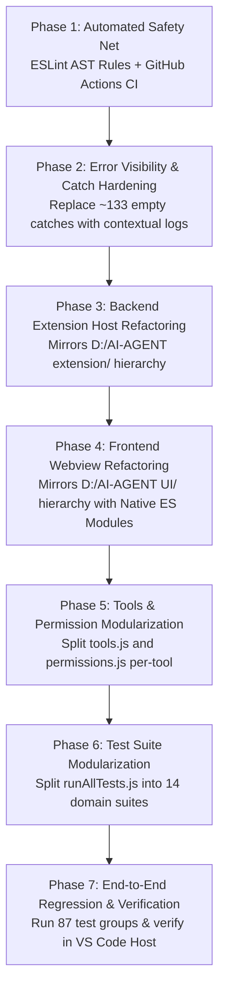

# Implementation Plan: CodeRun Architecture Modernization & Refactoring

**Target Repository:** `D:\cline-ollama` (`ai-agent` / CodeRun AI Agent v1.6.3)  
**Architectural Benchmark:** `D:\AI-AGENT` (Canonical 3-Tier Controller $\rightarrow$ Handler $\rightarrow$ Manager Reference)  
**Primary Goal:** Refactor the entire project to strictly mirror the proven 3-tier modular architecture from `D:\AI-AGENT`, decompose monolithic files (`extension.js`, `Dashboard.js`, `ChatSpace.js`, `tools.js`, `runAllTests.js`), eliminate swallowed errors (~133 empty catches), and automate style enforcement via ESLint AST rules and GitHub Actions CI.

---

## 1. Executive Summary & Problem Breakdown

| Concern in `D:\cline-ollama` | Current State | Pattern Violation | Target Architecture (from `D:\AI-AGENT`) |
|---|---|---|---|
| **1. Monolithic IPC Router** | `extension.js` (~1,950 lines, >60 switch branches in `handleFrontendMessage`) | Violates strict separation of concerns & Controller $\rightarrow$ Handler $\rightarrow$ Manager rule. Mixes activation, view resolution, HTML generation, and business logic inline. | **Backend 3-Tier Hierarchy:**<br>• `src/extension/main/extension.js` (~75 lines, activation only)<br>• `src/extension/main/html-manager.js` (synchronous HTML loader)<br>• `src/extension/main/agentview-manager.js` (webview provider)<br>• `src/extension/controller/UI-controller.js` (pure message router)<br>• `src/extension/manager/*handler.js` (payload validation & dispatch)<br>• `src/extension/manager/*-manager.js` (domain business logic). |
| **2. Giant UI Files** | `Dashboard.js` (6,115 lines) & `ChatSpace.js` (5,896 lines) in `src/` | Entire UI state, rendering, DOM events, and business logic bundled into 2 monolithic scripts using global variables. | **Frontend 3-Tier Hierarchy with Native ES Modules:**<br>• `src/UI/index.html` with `<script type="module" src="dashboard/dashboard.js"></script>`<br>• `src/UI/controller/host-controller.js` (pure router for `window.addEventListener("message")`)<br>• `src/UI/controller/vscode-api.js` (singleton `acquireVsCodeApi()`)<br>• `src/UI/dashboard/` (shell, status, logo)<br>• `src/UI/chats/` (modular managers: message, stream parser, diffs, checkpoints, plans, subagents, media, questions)<br>• `src/UI/settings/` (settings, models, traces, rules, MCP). |
| **3. Monolithic Tools & Permissions** | `tools.js` (2,290 lines) & `permissions.js` (148 lines) | All 34 tool implementations and permission handling concentrated in single files. | **Modular Per-Tool Architecture:**<br>• `src/extension/permission-manager/permission-store.js` (Map-based callback store) + per-tool permission files<br>• `src/extension/tools-manager/` (per-tool execution modules)<br>• `src/UI/permission-manager/permission-card.js` (interactive dialogs). |
| **4. Monolithic Test File** | `test/runAllTests.js` (3,583 lines, 87 test groups) | Single script with sequential assertions without suite isolation, per-domain runners, or individual suite execution. | Modularized test suites in `test/suites/*.test.js` coordinated by a clean, lightweight test runner in `test/runAllTests.js`. |
| **5. Missing Linter & CI/CD** | Style rules (no arrow functions, no classes, strict traditional `function` declarations) verified manually. | No automated quality gates in local dev or git workflow. Risk of syntax regression. | ESLint with custom AST rules prohibiting arrow functions, classes, IIFEs, and function expressions + GitHub Actions CI workflow (`.github/workflows/ci.yml`). |
| **6. Swallowed Errors** | ~133 instances of empty `catch (_) {}` across 24 files | Swallows critical diagnostic information during file IO, subagent execution, and IPC communication. | Standardized contextual logging via `console.warn` / `console.error` with specific subsystem prefixes (e.g. `[EXTENSION]`, `[SUBAGENT]`, `[TRACE]`). |

---

## 2. Target File & Folder Layout (Full Tree)

Mirroring `D:\AI-AGENT`, the refactored directory structure for `D:\cline-ollama` will be:

```
D:\cline-ollama\
├── package.json
├── .eslintrc.cjs                                 # ESLint style enforcement
├── .github/workflows/ci.yml                      # Automated CI pipeline
├── icons/logo.png
│
├── src/
│   ├── extension/                                # BACKEND EXTENSION HOST TIER
│   │   ├── main/
│   │   │   ├── extension.js                      # ~75 lines! Activation, command & view registration
│   │   │   ├── agentview-manager.js              # Resolves WebviewViewProvider & hooks up UI-controller
│   │   │   ├── commands-manager.js               # Command palette handlers (coderun.newChat, openSidebar, etc.)
│   │   │   └── html-manager.js                   # Reads src/UI/index.html, injects CSP, baseUri, and scripts
│   │   │
│   │   ├── controller/
│   │   │   └── UI-controller.js                  # PURE MESSAGE ROUTER (webview.onDidReceiveMessage)
│   │   │
│   │   ├── manager/                              # HANDLERS & BACKEND MANAGERS
│   │   │   ├── chatshandler.js                   # Handler: validates chat request payloads & replies
│   │   │   ├── chats-manager.js                  # Manager: chat thread storage, sorting, creation
│   │   │   ├── chats-message-manager.js          # Manager: chat message history & mutations
│   │   │   ├── chats-stream-manager.js           # Manager: streaming token response builder
│   │   │   ├── diffshandler.js                   # Handler: diff accept/reject request dispatch
│   │   │   ├── diffs-manager.js                  # Manager: diff tracking & patch application
│   │   │   ├── checkpointshandler.js             # Handler: checkpoint rollback & list requests
│   │   │   ├── checkpoints-manager.js            # Manager: file snapshots & restorations
│   │   │   ├── modelshandler.js                  # Handler: model fetch & select requests
│   │   │   ├── model-manager.js                  # Manager: provider model discovery
│   │   │   ├── settingshandler.js                # Handler: settings & API key save/delete requests
│   │   │   ├── settings-manager.js               # Manager: VS Code configuration & secret store
│   │   │   ├── traceshandler.js                  # Handler: execution trace query & export
│   │   │   ├── traces-manager.js                 # Manager: trace recording
│   │   │   ├── mcphandler.js                     # Handler: MCP server operations & tool toggles
│   │   │   ├── mcp-manager.js                    # Manager: MCP client coordination & transport
│   │   │   ├── ruleshandler.js                   # Handler: global & workspace rules file IO
│   │   │   ├── rules-manager.js                  # Manager: rules loading & caching
│   │   │   ├── subagentshandler.js               # Handler: subagent lifecycle IPC coordination
│   │   │   ├── subagents-manager.js              # Manager: subagent spawning, tracking, limits
│   │   │   ├── mediahandler.js                   # Handler: media export & disk reading
│   │   │   ├── media-manager.js                  # Manager: media storage & workspace copying
│   │   │   ├── terminalhandler.js                # Handler: terminal commands & interrupts
│   │   │   ├── terminal-manager.js               # Manager: dual terminals, shell integration, PTY
│   │   │   └── logo-manager.js                   # Manager: logo URI resolver
│   │   │
│   │   ├── permission-manager/                   # PER-TOOL PERMISSION STORE & CHECKS
│   │   │   ├── permission-store.js               # Map-based callback store (register/resolve)
│   │   │   ├── readfile.js / writefile.js / editfile.js
│   │   │   ├── deletefile.js / createfolder.js / deletefolder.js
│   │   │   ├── runterminal.js / spawnsubagent.js
│   │   │   └── listfile.js / getfileinfo.js
│   │   │
│   │   ├── tools-manager/                        # PER-TOOL BUSINESS LOGIC & EXECUTION
│   │   │   ├── readfile.js / writefile.js / editfile.js
│   │   │   ├── deletefile.js / createfolder.js / deletefolder.js
│   │   │   ├── patchfile.js / listdirectory.js / getfileinfo.js
│   │   │   ├── runterminal.js / terminalinput.js
│   │   │   └── askquestion.js / createplan.js / updateplan.js
│   │   │
│   │   ├── tools/                                # CORE TOOL RUNTIMES
│   │   │   ├── tools.js                          # Tool registry aggregation with path traversal guards
│   │   │   ├── toolsexecutor.js                  # Tool execution engine (generator runner, verify, recover)
│   │   │   ├── toolsregistry.js                  # Tool definitions registry
│   │   │   ├── tools-definitions.js              # Tool JSON schemas for LLMs
│   │   │   ├── pathSecurity.js                   # Sandbox & workspace path containment
│   │   │   └── fileLockManager.js                # Mutex for concurrent file mutations
│   │   │
│   │   ├── providers/                            # MULTI-PROVIDER LLM ADAPTERS
│   │   │   ├── provider-manager.js               # Factory for Ollama, OpenAI, Anthropic, Gemini, Groq, OpenRouter
│   │   │   ├── modelClassifier.js                # Modality inspection & timeout rules
│   │   │   ├── providerOllama.js
│   │   │   ├── providerOpenAI.js
│   │   │   ├── providerAnthropic.js
│   │   │   ├── providerGemini.js
│   │   │   ├── providerGroq.js
│   │   │   ├── providerOpenRouter.js
│   │   │   └── providerCompatible.js
│   │   │
│   │   └── agents/                               # AGENT RUNTIME & ENGINES
│   │       ├── agent.js / agentLoop.js           # Think → Plan → Act → Verify orchestrator
│   │       ├── agentState.js                     # Finite state machine
│   │       ├── contextEngine.js                  # Startup context & prompt rebuilds
│   │       ├── delegationEngine.js               # Subagent harvest & waiting
│   │       ├── decisionEngine.js                 # Concluding LLM response forcing
│   │       ├── mediaRuntime.js                   # Direct image/video routing
│   │       ├── toolContextBuilder.js             # Hygiene & loop repetition checks
│   │       ├── promptBuilder.js                  # System prompt & message assembly
│   │       └── constants.js                      # IDs, events, tool sets
│   │
│   └── UI/                                       # FRONTEND WEBVIEW TIER (DOM & BROWSER ONLY)
│       ├── index.html                            # HTML entry: <script type="module" src="dashboard/dashboard.js">
│       │
│       ├── controller/
│       │   ├── host-controller.js                # PURE MESSAGE ROUTER (window.addEventListener("message"))
│       │   ├── tools-handler.js                  # Dispatches tool permission requests to permission-card.js
│       │   └── vscode-api.js                     # Singleton export: const vscode = acquireVsCodeApi();
│       │
│       ├── dashboard/
│       │   ├── dashboard.js                      # Root UI bootstrap (imports chats.js, settings.js, logo)
│       │   ├── dashboard.css                     # Header, navigation rail, status indicators styling
│       │   └── logo-manager.js                   # Logo rendering in header
│       │
│       ├── chats/
│       │   ├── chats.js                          # Chat view layout & tab switching
│       │   ├── chat.css                          # Chat bubbles, tool cards, inputs styling
│       │   ├── chats-manager.js                  # Chat session list rendering & thread switching
│       │   ├── chats-message-manager.js          # User & bot message bubbles, composer state
│       │   ├── chats-diff-manager.js             # Interactive diff cards (Accept / Reject)
│       │   ├── chats-checkpoint-manager.js       # Rollback checkpoint cards & undo buttons
│       │   ├── chats-plan-manager.js             # Todos / checklist rendering & auto-fade
│       │   ├── chats-stream-parser.js            # Live token & thinking stream chunk parsing
│       │   ├── chats-subagent-manager.js         # Subagent execution cards & status pills
│       │   ├── chats-media-manager.js            # HTML5 video player & media cards
│       │   └── chats-question-manager.js         # Interactive user question banners (ask_question)
│       │
│       ├── settings/
│       │   ├── settings.js                       # Settings tab layout & toggle handlers
│       │   ├── settings.css                      # Settings form styling
│       │   ├── settings-manager.js               # Provider form inputs, API key save/delete
│       │   ├── model-manager.js                  # Searchable model combobox
│       │   ├── command-handler.js                # Settings action dispatchers
│       │   ├── rules-manager.js                  # Rules editor with line numbers
│       │   ├── mcp-manager.js                    # MCP server management cards
│       │   └── traces-manager.js                 # Trace tree visualization
│       │
│       ├── permission-manager/
│       │   └── permission-card.js                # Interactive permission dialog card rendering
│       │
│       └── tools-manager/
│           ├── readfile.js                       # Tool-specific UI card formatters
│           ├── listfile.js
│           └── runterminal.js
│
└── test/
    ├── runAllTests.js                            # Master orchestrator executing test suites in order
    ├── test-helpers.js                           # Shared fixtures and assertions
    ├── mocks/vscode/                             # VS Code API mock
    └── suites/
        ├── terminal.test.js                      # Tests 1, 24, 25, 29, 33, 42, 43, 48
        ├── permissions.test.js                   # Tests 2, 3, 40
        ├── diff-checkpoint.test.js               # Tests 4, 6, 7, 16, 17, 19, 22, 23, 31, 32, 34, 36, 37
        ├── security.test.js                      # Tests 5, 10, 11, 47
        ├── sqlite-knowledge.test.js              # Tests 8, 18, 35
        ├── search-symbol.test.js                 # Test 9
        ├── trace-redaction.test.js               # Tests 12, 26, 55, 59
        ├── verification-recovery.test.js         # Tests 13, 14
        ├── planning-runtime.test.js              # Tests 15, 21, 41
        ├── agent-loop.test.js                    # Tests 27, 28, 30, 38, 39
        ├── mcp-protocol.test.js                  # Tests 20, 44, 49
        ├── context-optimization.test.js          # Tests 45, 46
        ├── questions.test.js                     # Test 50
        └── subagents.test.js                     # Tests 51–60
```

---

## 3. The 3-Tier Architectural Mechanics (Directly from `D:\AI-AGENT`)

### Tier 1: Controllers (Pure Event Routers)
Controllers have **zero business logic** and **zero state mutation**. They exist solely to route incoming messages to handlers.

- **Backend Extension Controller (`src/extension/controller/UI-controller.js`):**
  ```javascript
  // UI-controller.js
  export function uiresponse(webviewView, context) {
      webviewView.webview.onDidReceiveMessage(function(message) {
          ondidreceivemessage(message, webviewView, context);
      });
  }

  function ondidreceivemessage(message, webviewView, context) {
      handlemessage(message, webviewView, context);
  }

  function handlemessage(message, webviewView, context) {
      if (message.id === "chatmessage") {
          handlechatmessagerequest(message, webviewView, context);
      } else if (message.id === "resolvediff") {
          handleresolvediff(message, webviewView, context);
      } else if (message.id === "rollbackcheckpoint") {
          handlerollbackcheckpoint(message, webviewView, context);
      } else if (message.id === "savesettings") {
          handlesavesettingsrequest(message, webviewView, context);
      } // ... strictly delegates to handler functions
  }
  ```

- **Frontend Webview Controller (`src/UI/controller/host-controller.js`):**
  ```javascript
  // host-controller.js
  export function registerresponses() {
      window.addEventListener("message", receivemessage);
  }

  function receivemessage(event) {
      ondidreceivemessage(event.data);
  }

  function ondidreceivemessage(message) {
      handlemessage(message);
  }

  function handlemessage(message) {
      if (message.id === "streamchunk") {
          handleRawChunk(message.line, message.chatId);
      } else if (message.id === "diff_resolved_response") {
          handlediffresolvedresponse(message);
      } else if (message.id === "checkpoint_rollback_response") {
          handlecheckpointrollbackresponse(message);
      } else if (message.id === "settings") {
          handlesettingsresponse(message);
      } // ... strictly delegates to UI managers
  }
  ```

### Tier 2: Handlers (Payload Parsers & Coordinators)
Located in `src/extension/manager/*handler.js`. Handlers:
1. Parse and validate the incoming message payload.
2. Call one or more managers to perform business logic.
3. Post the response back through the IPC channel:
   ```javascript
   export async function handleresolvediff(message, webviewView, context) {
       var diffId = message.diffId;
       var accepted = Boolean(message.accepted);
       var workspace = getWorkspaceFolder(context);

       var result = await resolvePendingDiff(diffId, accepted, workspace);

       webviewView.webview.postMessage({
           id: "diff_resolved_response",
           diffId: diffId,
           accepted: accepted,
           success: Boolean(result && result.success),
           error: result && result.error ? result.error : null
       });
   }
   ```

### Tier 3: Managers (Business Logic, Mutations, Storage)
Located in `src/extension/manager/*-manager.js`, `src/extension/tools-manager/`, `src/extension/permission-manager/` (backend) and `src/UI/*/*-manager.js` (frontend):
- Pure implementations of business logic.
- Perform disk IO, execute terminal commands, apply diffs, manage database state, or render DOM elements.
- Never touch VS Code IPC messaging directly.

---

## 4. Phased Implementation Roadmap



---

### Phase 1: Automated Safety Net (ESLint & CI Pipeline)

**Deliverables:**
1. **`.eslintrc.cjs`**: Enforces traditional named function declarations, no arrow functions, no classes, no IIFEs, no `.bind()`, and no empty catch blocks.
2. **`package.json`**: Adds `npm run lint` and `npm run lint:fix`.
3. **`.github/workflows/ci.yml`**: Automates linting and running tests on Node 18+ for all pushes/PRs.

---

### Phase 2: Error Visibility & Catch Block Hardening

**Deliverables:**
Replace all ~133 empty `catch (_) {}` blocks across 24 files with contextual, subsystem-prefixed logging:
```javascript
// BEFORE:
try { await executionTrace.saveTraceToDisk(storagePath, sessionId); } catch (_) {}

// AFTER:
try {
  await executionTrace.saveTraceToDisk(storagePath, sessionId);
} catch (traceErr) {
  console.warn('[EXTENSION] Failed to persist trace for session ' + sessionId + ':', traceErr ? traceErr.message : traceErr);
}
```

---

### Phase 3: Backend Extension Host Refactoring (Matching `D:\AI-AGENT`)

**Deliverables:**
1. **`src/extension/main/extension.js`**: Reduce to ~75 lines. Only registers commands (`coderun.newChat`, `coderun.openSidebar`) and webview provider.
2. **`src/extension/main/html-manager.js`**: Synchronously loads `src/UI/index.html`, replaces resource URIs (`webview.asWebviewUri`), injects CSP and baseUri.
3. **`src/extension/main/agentview-manager.js`**: Resolves `WebviewViewProvider` and attaches `UI-controller.js`.
4. **`src/extension/controller/UI-controller.js`**: Pure message router mapping `message.id` / `message.type` to handlers.
5. **`src/extension/manager/`**:
   - `chatshandler.js` & `chats-manager.js`
   - `diffshandler.js` & `diffs-manager.js`
   - `checkpointshandler.js` & `checkpoints-manager.js`
   - `settingshandler.js` & `settings-manager.js`
   - `modelshandler.js` & `model-manager.js`
   - `traceshandler.js` & `traces-manager.js`
   - `mcphandler.js` & `mcp-manager.js`
   - `ruleshandler.js` & `rules-manager.js`
   - `subagentshandler.js` & `subagents-manager.js`
   - `mediahandler.js` & `media-manager.js`
   - `terminalhandler.js` & `terminal-manager.js`
   - `logo-manager.js`

---

### Phase 4: Frontend Webview Refactoring (Matching `D:\AI-AGENT`)

**Deliverables:**
1. **`src/UI/index.html`**: Native HTML template with `<script type="module" src="dashboard/dashboard.js"></script>`.
2. **`src/UI/controller/host-controller.js`**: Main webview message receiver listening to `window.addEventListener("message")` and delegating to UI managers.
3. **`src/UI/controller/vscode-api.js`**: 12-line singleton export of `acquireVsCodeApi()`.
4. **`src/UI/dashboard/`**:
   - `dashboard.js`: Top-level bootstrap importing `chats.js`, `settings.js`, `logo-manager.js`.
   - `dashboard.css`: Shell styling.
   - `logo-manager.js`: Header logo management.
5. **`src/UI/chats/`**: Decompose `ChatSpace.js` (5,896 lines) into:
   - `chats.js` (view container)
   - `chats-manager.js` (session thread switcher)
   - `chats-message-manager.js` (user/bot bubbles, composer input)
   - `chats-diff-manager.js` (interactive diffs & accept/reject)
   - `chats-checkpoint-manager.js` (rollback checkpoint cards)
   - `chats-plan-manager.js` (todos / checklist)
   - `chats-stream-parser.js` (token streaming & thinking tag extraction)
   - `chats-subagent-manager.js` (subagent cards)
   - `chats-media-manager.js` (HTML5 video player & media cards)
   - `chats-question-manager.js` (interactive question banners)
6. **`src/UI/settings/`**: Decompose `Dashboard.js` (6,115 lines) into:
   - `settings.js` (settings view container)
   - `settings-manager.js` (provider form inputs, API keys)
   - `model-manager.js` (searchable model combobox)
   - `traces-manager.js` (trace tree visualization)
   - `rules-manager.js` (in-app rules editor)
   - `mcp-manager.js` (MCP server catalog & tool toggles)

---

### Phase 5: Tools & Permission Modularization

**Deliverables:**
1. **`src/extension/permission-manager/permission-store.js`**: Central `Map`-based callback registry for pending permission requests.
2. **Per-tool permission modules**: `readfile.js`, `writefile.js`, `editfile.js`, `deletefile.js`, `createfolder.js`, `runterminal.js`, etc.
3. **Per-tool execution modules** in `src/extension/tools-manager/`.
4. **`src/UI/permission-manager/permission-card.js`**: Clean UI card for interactive tool approval.

---

### Phase 6: Test Suite Modularization

**Deliverables:**
Split `test/runAllTests.js` (3,583 lines) into 14 domain-isolated test suites under `test/suites/`:
- `terminal.test.js`, `permissions.test.js`, `diff-checkpoint.test.js`, `security.test.js`, `sqlite-knowledge.test.js`, `search-symbol.test.js`, `trace-redaction.test.js`, `verification-recovery.test.js`, `planning-runtime.test.js`, `agent-loop.test.js`, `mcp-protocol.test.js`, `context-optimization.test.js`, `questions.test.js`, `subagents.test.js`.
- Lightweight runner in `test/runAllTests.js` executing suites and reporting metrics.

---

### Phase 7: Verification & Regression Plan

1. **Syntax Integrity:** Run `node --check` across every single JavaScript file.
2. **Coding Standards:** Run `npm run lint` to guarantee 0 arrow functions, 0 classes, 0 IIFEs.
3. **Regression Suite:** Run `npm test` to verify all 87 test groups pass with 0 errors.
4. **Interactive Extension Validation:** Launch Extension Development Host (`F5`), test multi-turn chat, model switching, interactive terminal, diff review, checkpoints, and MCP servers.
